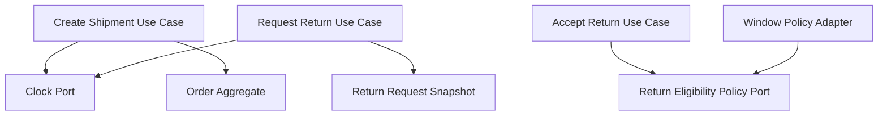

# Lesson 014: Real Return Window Policy

## Objective

Replace the placeholder return-acceptance rule with a real time-based return window using shipped dates and product snapshots.

## Theory

Lesson `013` introduced a return-policy port, but the adapter was still only a stand-in. It rejected requests based on text inside the reason field.

That was useful as a structural lesson, but it is not a real business rule.

This lesson makes the rule concrete by introducing the minimum state needed to evaluate it:

- how many days each product may be returned
- when the order actually shipped
- when the return was requested

The policy adapter can then answer the real business question:

- is this return request still inside the allowed window?

This keeps date calculation outside the use case while preserving workflow inside the core.

## Why This Matters Here

Hexagonal Architecture becomes more convincing when ports are used for real decisions instead of placeholders.

The return workflow now depends on:

- a shipment-time snapshot in the order
- a return-window snapshot in the sold lines
- a clock boundary for time-sensitive operations

That is a meaningful architectural step, not just extra data.

## Diagram

## Implementation Focus

Implement:

- product `ReturnWindowDays`
- shipped timestamp on the order
- requested timestamp on the return request
- a clock port for shipment and return-request timing
- a real window-based return policy adapter

Deliberately leave for later:

- actor metadata
- partial-line windows
- business-calendar rules

## What To Verify

- the project compiles
- shipment records a shipped timestamp
- a return inside the window can be accepted
- a return outside the window cannot be accepted
- clearance items still cannot be returned
