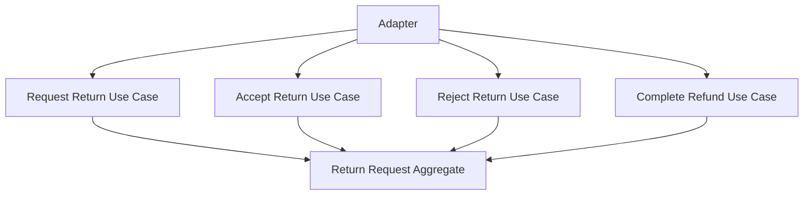

# Lesson 015: Return Actor Metadata

## Objective

Preserve the business actor identity on return request, review, and refund operations.

## Theory

The return workflow is now structurally complete and policy-aware, but it still drops an important part of the canonical contract:

- who requested the return
- who reviewed it
- who processed the refund

Those are not transport concerns. They are part of the business record.

This lesson makes that explicit by storing actor metadata in the return request aggregate and requiring the relevant use cases to provide it.

That solves the problem where the workflow is technically correct but operationally unauditable.

The tradeoff is slightly wider use-case signatures, but the resulting model better reflects real command handling.

## Why This Matters Here

Hexagonal Architecture should make business interactions traceable without coupling the core to authentication or HTTP request types.

The core only needs the actor identity string:

- `requestedBy`
- `reviewedBy`
- `processedBy`

Adapters can supply those values from any transport layer.

## Diagram

## Implementation Focus

Implement:

- actor fields on the return request aggregate
- actor-required validation in request, accept, reject, and refund paths
- tests proving actor metadata is stored and enforced

Deliberately leave for later:

- richer audit history
- idempotency keys
- authentication/authorization concerns

## What To Verify

- the project compiles
- requested returns store `requestedBy`
- accepted or rejected returns store `reviewedBy`
- refunded returns store `processedBy`
- missing actor values are rejected
