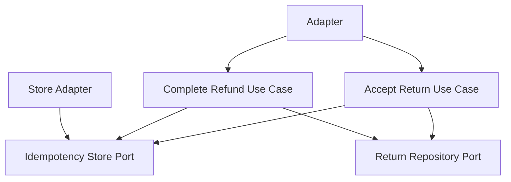

# Lesson 016: Return Command Idempotency

## Objective

Make return acceptance and refund completion idempotent so retries do not duplicate business effects.

## Theory

The return workflow is now policy-aware and auditable, but retry-sensitive commands still have a risk:

- an `accept return` retry could try to review the same request twice
- a `complete refund` retry could try to refund and restock twice

The canonical contract already marks these commands as idempotent through `Idempotency-Key`.

This lesson adds an idempotency boundary through a port so the core can safely tolerate duplicate command delivery without embedding transport concerns into the domain model.

The use case shape is:

- check whether this command key has already been seen
- if yes, return the previously affected resource
- if no, execute once and remember the key

## Why This Matters Here

Hexagonal Architecture should make operational safety explicit too, not only pure business rules.

This is a good fit for a port because key storage is infrastructure, while the decision to treat retries as the same command belongs in the application workflow.

## Diagram

## Implementation Focus

Implement:

- an `IdempotencyStore` port
- idempotent accept-return handling
- idempotent complete-refund handling
- tests proving duplicate keys do not duplicate state changes

Deliberately leave for later:

- generalized idempotency across all commands
- expiration/cleanup of remembered keys
- conflict detection for mismatched payload retries

## What To Verify

- the project compiles
- accepting a return with the same key twice returns the same accepted result
- refunding with the same key twice returns the same refunded result
- restocking happens only once for duplicate refund retries
