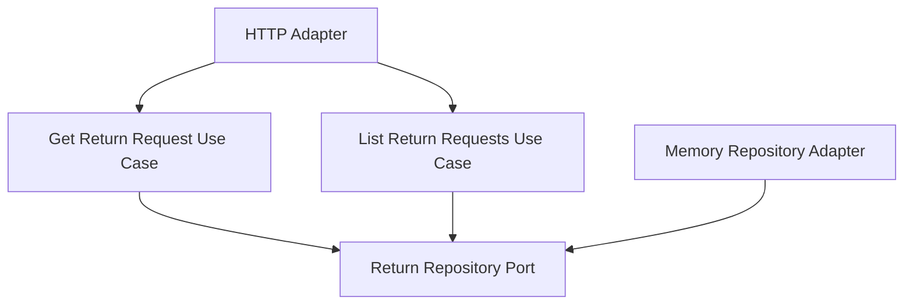

# Lesson 017: Return Query Surface

## Objective

Add an explicit read-side surface for returns so the hexagonal example shows both command and query flow.

## Theory

The hexagonal track now has a substantial return workflow:

- request
- review
- refund
- restock
- actor metadata
- idempotency

But all of that is still biased toward writes. A real application also needs a stable way to inspect the resulting state.

This lesson introduces a small read-side surface:

- fetch one return request by id
- list return requests by status

That keeps the query model simple while making the architecture easier to recognize end to end.

## Why This Matters Here

Hexagonal Architecture is not only about protecting writes. It should also make query use cases explicit instead of letting adapters reach directly into persistence.

The core now owns both:

- command orchestration
- query orchestration

Even when the query logic is simple, the boundary is still worth making visible.

## Diagram

## Implementation Focus

Implement:

- `GetReturnRequestUseCase`
- `ListReturnRequestsUseCase`
- repository support for listing by status
- a return HTTP handler exposing `GET /returns/{id}` and `GET /returns?status=...`

Deliberately leave for later:

- pagination
- sorting
- richer read models

## What To Verify

- the project compiles
- a return request can be fetched by id
- return requests can be listed by status
- the HTTP adapter exposes both read paths
