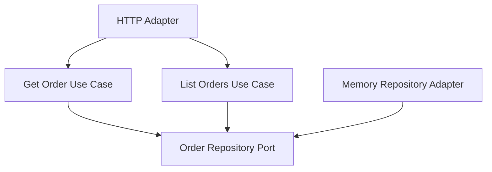

# Lesson 018: Order Query Surface

## Objective

Add an explicit read-side surface for orders so the core exposes the main workflow state after quote conversion, payment, and shipment.

## Theory

Lesson `017` added a query surface for returns. That improved the read side, but the broader workflow still lacks an equivalent query boundary for orders.

Orders are the central object most downstream steps depend on. A small query surface makes the architecture more complete:

- fetch one order by id
- list orders by status

This keeps the read model simple while making the order lifecycle observable without leaking repository access into adapters.

## Why This Matters Here

The canonical contract includes order listing by status, especially for states like `ReadyForFulfillment`.

Hexagonal Architecture should make that read path explicit in the same way it already makes command paths explicit.

## Diagram

## Implementation Focus

Implement:

- `GetOrderUseCase`
- `ListOrdersUseCase`
- repository support for listing orders by status
- an order HTTP handler exposing `GET /orders/{id}` and `GET /orders?status=...`

Deliberately leave for later:

- customer-based filtering
- pagination
- richer order read models

## What To Verify

- the project compiles
- an order can be fetched by id
- orders can be listed by status
- the HTTP adapter exposes both order read paths
