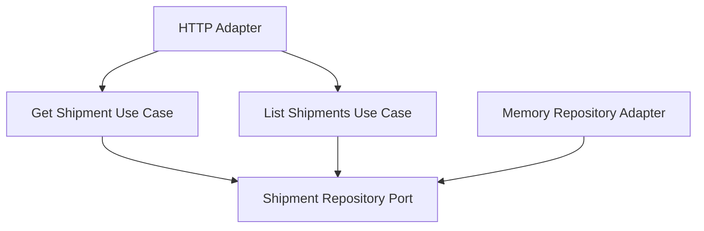

# Lesson 019: Shipment Query Surface

## Objective

Add an explicit read-side surface for shipments so the fulfillment part of the workflow is queryable through the core.

## Theory

The architecture now has query surfaces for returns and orders, but shipment reads are still implicit.

That leaves a gap in the fulfillment story because shipments are the concrete output of the shipping workflow. A small read-side surface makes that state available without reaching around the core:

- fetch one shipment by id
- list shipments by order id

This is enough to make the fulfillment read path visible without introducing a more complex reporting model yet.

## Why This Matters Here

The canonical contract includes shipment lookup and shipment listing by `orderId`.

Hexagonal Architecture should treat those as explicit application use cases, just like the write-side shipment creation path.

## Diagram

## Implementation Focus

Implement:

- `GetShipmentUseCase`
- `ListShipmentsUseCase`
- repository support for listing shipments by order id
- a shipment HTTP handler exposing `GET /shipments/{id}` and `GET /shipments?orderId=...`

Deliberately leave for later:

- filtering by shipment status
- pagination
- richer fulfillment projections

## What To Verify

- the project compiles
- a shipment can be fetched by id
- shipments can be listed by order id
- the HTTP adapter exposes both shipment read paths
