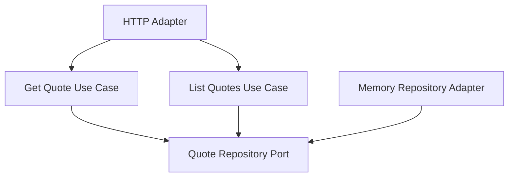

# Lesson 020: Quote List Query Surface

## Objective

Add quote listing by status so the quote side matches the query surfaces already added for orders, returns, and shipments.

## Theory

Quotes already have a get-by-id path, but the read side is still uneven compared with the rest of the workflow.

That matters because quotes are often reviewed in groups, especially around approval states like `PendingApproval`.

This lesson adds the smallest missing query capability:

- list quotes by status

That keeps the read model simple while making the quote lifecycle more operationally useful.

## Why This Matters Here

The canonical contract includes `quotes list --status PendingApproval`.

Hexagonal Architecture should make that read path explicit in the same way it already makes:

- `returns list`
- `orders list`
- `shipments list`

## Diagram

## Implementation Focus

Implement:

- `ListQuotesUseCase`
- repository support for listing quotes by status
- quote HTTP handler support for `GET /quotes?status=...`

Deliberately leave for later:

- customer-based filtering
- pagination
- richer quote read models

## What To Verify

- the project compiles
- quotes can be listed by status
- pending-approval quotes are queryable
- the HTTP adapter exposes the quote list path
