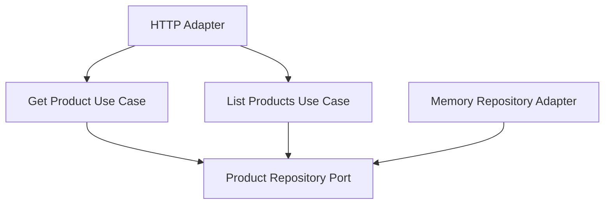

# Lesson 021: Product Query Surface

## Objective

Add an explicit read-side surface for products so catalog data is queryable through the same hexagonal boundaries as the workflow objects.

## Theory

Products already influence several important behaviors:

- quote pricing inputs
- approval decisions
- return-window policy

But the architecture still lacks a first-class query path for product data. That leaves adapters or demos with no clear way to inspect catalog state through the core.

This lesson adds a simple catalog read surface:

- fetch one product by sku
- list products with lightweight filters

That keeps the read side small while making the product boundary visible in the architecture.

## Why This Matters Here

The canonical contract includes product listing with filters like `category` and `availability`.

Hexagonal Architecture should express that as:

- repository capability
- application query use cases
- adapter-facing HTTP surface

instead of direct repository reach-through from handlers.

## Diagram

## Implementation Focus

Implement:

- product repository list capability
- `GetProductUseCase`
- `ListProductsUseCase`
- product HTTP handler exposing `GET /products/{sku}` and `GET /products?...`

Deliberately leave for later:

- pagination
- price-range filtering
- richer catalog projections

## What To Verify

- the project compiles
- a product can be fetched by sku
- products can be listed by category and availability
- the HTTP adapter exposes both product read paths
