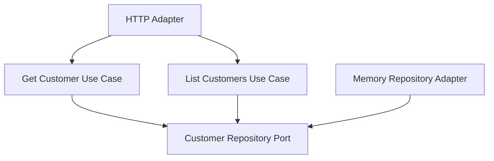

# Lesson 022: Customer Query Surface

## Objective

Add an explicit read-side surface for customers so the last primary entity also has core-owned query paths.

## Theory

By this point, the hexagonal track already exposes query surfaces for:

- quotes
- orders
- shipments
- returns
- products

Customers are the last obvious primary entity still missing the same treatment.

This lesson adds a deliberately small customer read surface:

- fetch one customer by id
- list customers
- optionally filter to active customers

That is enough to keep the architecture consistent without first expanding the customer model beyond what the current lessons already use.

## Why This Matters Here

Even with a simple domain model, the query boundary still matters.

Adapters should ask the core for customer state the same way they ask for other entity state, rather than reaching directly into repository details.

## Diagram

## Implementation Focus

Implement:

- customer repository list capability
- `GetCustomerUseCase`
- `ListCustomersUseCase`
- customer HTTP handler exposing `GET /customers/{id}` and `GET /customers?status=Active`

Deliberately leave for later:

- richer customer commercial fields
- tier/payment-terms filtering
- pagination

## What To Verify

- the project compiles
- a customer can be fetched by id
- customers can be listed
- active-only filtering works
- the HTTP adapter exposes both customer read paths
