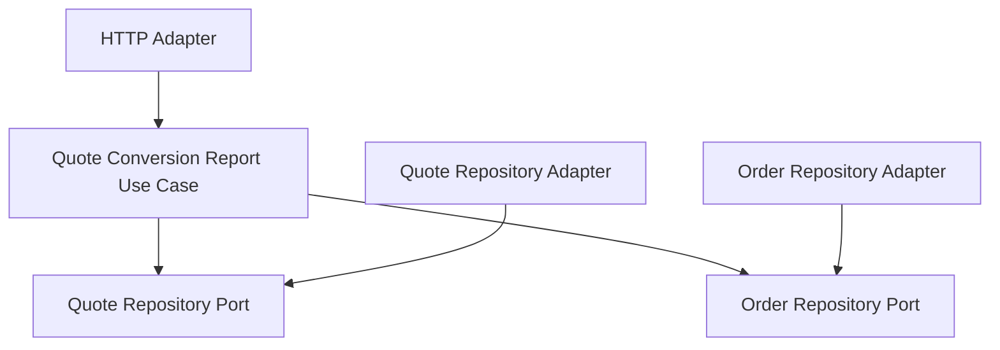

# Lesson 023: Quote Conversion Report

## Objective

Add the first projection-style report query so the read side can reshape workflow state instead of only returning aggregates.

## Theory

The previous lessons added explicit get/list query surfaces for the main entities.

That was useful, but a real application also needs read models that summarize workflow, not just expose stored records. This lesson introduces that idea with a small reporting query:

- quote conversion

This report does not return one aggregate. It combines quote and order state to answer a higher-level question:

- how many quotes exist
- how many are approved
- how many have converted to orders
- what is the conversion rate

That is the first real projection in the hexagonal track.

## Why This Matters Here

Hexagonal Architecture should support query models that are shaped for decisions, not only for CRUD.

This lesson makes that visible without adding a separate reporting database yet:

- repositories provide source state
- the application layer assembles the report
- the HTTP adapter exposes the projection

## Diagram

## Implementation Focus

Implement:

- a `GetQuoteConversionReportUseCase`
- a small report DTO
- an HTTP report handler for `GET /reports/quote-conversion`
- tests proving the report combines quote and order data correctly

Deliberately leave for later:

- materialized read models
- report pagination/export
- additional report endpoints

## What To Verify

- the project compiles
- quote conversion totals are computed correctly
- approved and converted counts are reported correctly
- the HTTP adapter exposes the report endpoint
