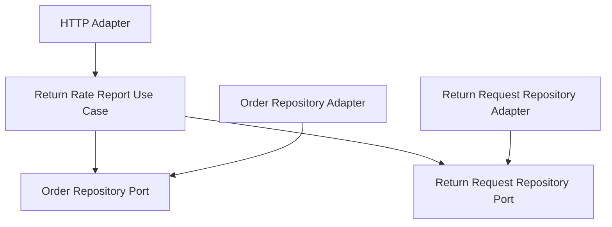

# Lesson 024: Return Rate By Category Report

## Objective

Add a second projection-style report query that summarizes reverse-flow behavior by product category.

## Theory

Lesson `023` introduced the idea that the read side can assemble workflow projections instead of only returning aggregates.

This lesson applies the same pattern to returns with a more business-shaped question:

- how much shipped volume exists per category
- how much of that volume was returned
- what is the return rate for each category

That turns the report into a real ratio, not only a grouped count.

## Why This Matters Here

Hexagonal Architecture should make it easy to compute read models from stable domain snapshots without pushing reporting logic into adapters.

This lesson keeps that boundary clear:

- repositories provide shipped orders and return requests
- the application layer computes category totals and rates
- the HTTP adapter exposes the projection

## Diagram

## Implementation Focus

Implement:

- a `GetReturnRateByCategoryReportUseCase`
- a row DTO with category, shipped quantity, returned quantity, and rate
- an HTTP report handler for `GET /reports/return-rate-by-category`
- tests proving requested returns do not count until they are accepted

Deliberately leave for later:

- date windows and trending reports
- customer-segment breakdowns
- exported report files

## What To Verify

- the project compiles
- shipped quantities are grouped by product category
- only accepted or refunded returns count in the numerator
- the HTTP adapter exposes the report endpoint
