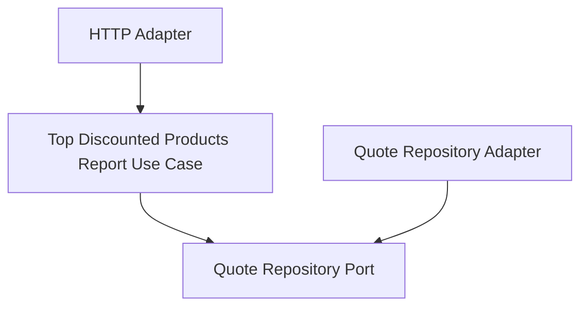

# Lesson 025: Top Discounted Products Report

## Objective

Add another projection-style report that ranks quoted products by discount intensity using existing quote pricing snapshots.

## Theory

The previous reporting lessons showed two projection patterns:

- workflow conversion ratios
- return behavior by category

This lesson shifts to pricing analysis. Instead of asking whether a workflow advanced or reversed, the read side now answers:

- which products accumulated the most discount amount
- how much quantity was quoted for each product
- what the average discount rate looks like

That is still a pure query concern. The report reads quote lines and reshapes them into a pricing-focused view.

## Why This Matters Here

Hexagonal Architecture should let the application layer build business-oriented reports from stable snapshots already captured in the domain.

This lesson makes that visible with no write-side changes:

- quote repositories provide stored quote lines
- the application layer aggregates discount amounts
- the HTTP adapter exposes ranked report rows

## Diagram

## Implementation Focus

Implement:

- a `GetTopDiscountedProductsReportUseCase`
- a row DTO with SKU, name, quoted quantity, discount amount, and average rate
- an HTTP report handler for `GET /reports/top-discounted-products`
- tests proving the rows are ranked by total discount amount

Deliberately leave for later:

- date filtering
- customer-tier segmentation
- pagination or top-N limits

## What To Verify

- the project compiles
- discount totals are computed from base versus adjusted unit prices
- products are ordered by highest total discount amount
- the HTTP adapter exposes the report endpoint
