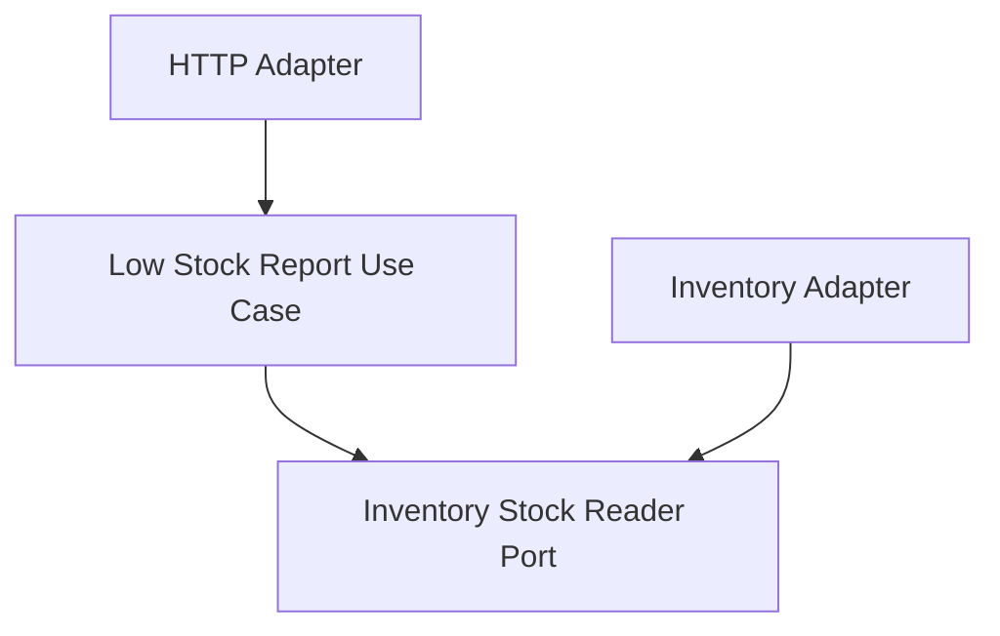

# Lesson 026: Low Stock Items Report

## Objective

Add the inventory-focused reporting endpoint so the read side can surface replenishment signals from stock state.

## Theory

The previous reporting lessons projected workflow and pricing information from quotes, orders, and returns.

This lesson shifts attention to stock visibility. The report answers:

- which SKUs are at or below their reorder threshold
- how much stock is still available
- what threshold triggered the alert

That makes inventory state queryable as a business signal rather than an adapter-only detail.

## Why This Matters Here

Hexagonal Architecture should keep inventory reporting behind a port just like the write-side reservation and restock flows.

This lesson adds that missing read boundary:

- the inventory adapter exposes stock snapshots through a port
- the application layer filters low-stock items
- the HTTP adapter exposes the report endpoint

## Diagram

## Implementation Focus

Implement:

- a small `StockRecord` domain type
- an `InventoryStockReader` port
- a `GetLowStockItemsReportUseCase`
- an HTTP report handler for `GET /reports/low-stock-items`
- tests proving only threshold-breaching items are returned

Deliberately leave for later:

- stock receive commands
- reorder threshold write use cases
- warehouse/location-specific inventory

## What To Verify

- the project compiles
- only items at or below threshold are reported
- rows expose available quantity and reorder threshold
- the HTTP adapter exposes the report endpoint
