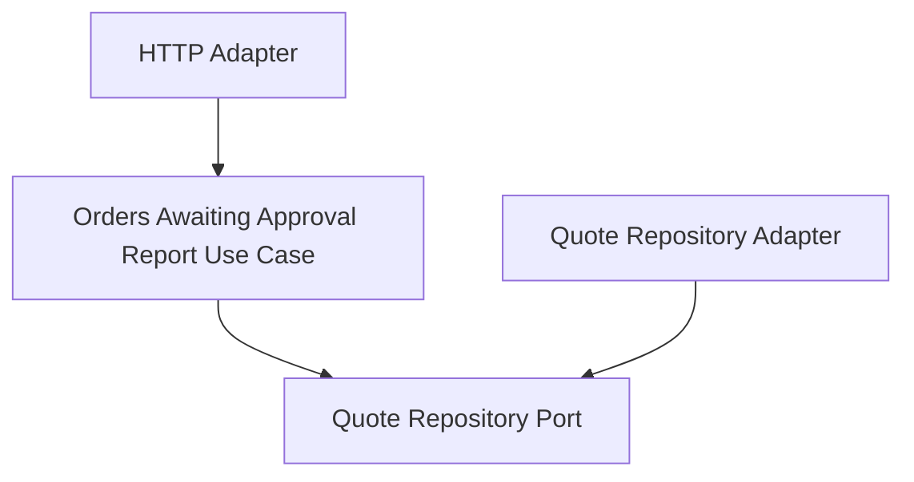

# Lesson 027: Orders Awaiting Approval Report

## Objective

Add the remaining approval-work-queue report so the read side can expose commercial review backlog explicitly.

## Theory

The canonical reporting surface includes `orders-awaiting-approval`, but the current hexagonal implementation has no separate order-approval aggregate yet.

The existing workflow already has the right business signal:

- quotes in `PendingApproval`

This lesson treats that state as the approval work queue and projects it into a report-oriented view.

## Why This Matters Here

Hexagonal Architecture should let the application layer reshape existing workflow state into queue-oriented read models without forcing a premature write-side redesign.

This lesson keeps the change narrow:

- quote repository remains the source of truth
- the application layer assembles approval queue rows
- the HTTP adapter exposes the report endpoint

## Diagram

## Implementation Focus

Implement:

- a `GetOrdersAwaitingApprovalReportUseCase`
- report rows with quote id, customer id, line count, and total amount
- an HTTP report handler for `GET /reports/orders-awaiting-approval`
- tests proving only `PendingApproval` quotes appear in the queue

Deliberately leave for later:

- separate approval-request aggregates
- reviewer assignment metadata
- aging and SLA metrics

## What To Verify

- the project compiles
- only pending-approval quotes are returned
- rows expose queue-oriented summary fields
- the HTTP adapter exposes the report endpoint
