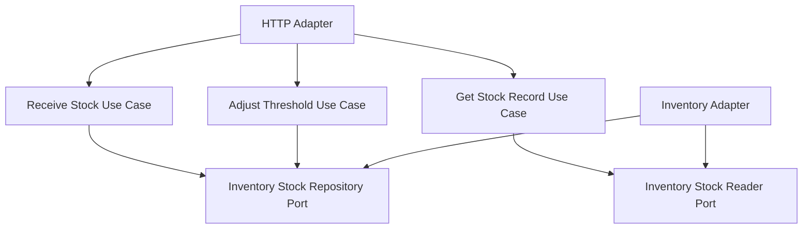

# Lesson 028: Inventory Write Model

## Objective

Promote inventory from a helper adapter into a first-class application boundary with explicit stock commands and stock reads.

## Theory

Until now, inventory mostly existed as a dependency behind order conversion, shipment, returns, and reporting.

That was enough to demonstrate reservation and stock movement, but not enough to show that inventory can stand on its own as an application slice with its own commands:

- receive stock
- adjust reorder threshold
- get stock record

This lesson makes inventory an explicit part of the hexagonal surface instead of only a supporting detail.

## Why This Matters Here

Hexagonal Architecture is more convincing when supporting concerns are also expressed through use cases and ports, not only the main sales workflow.

This lesson adds that structure:

- a stock repository port for inventory state
- application use cases for inventory commands
- an HTTP adapter dedicated to inventory endpoints

## Diagram

## Implementation Focus

Implement:

- inventory stock domain behavior for receiving stock and threshold updates
- a repository-style port for stock records
- `ReceiveStockUseCase`
- `AdjustReorderThresholdUseCase`
- `GetStockRecordUseCase`
- an HTTP adapter for `/inventory/{sku}`, `/inventory/{sku}/receive`, and `/inventory/{sku}/reorder-threshold`

Deliberately leave for later:

- multiple warehouse locations
- reservation versus on-hand separation
- stock audit history

## What To Verify

- the project compiles
- stock can be received for an existing or first-time SKU
- reorder threshold updates persist
- the HTTP adapter exposes inventory commands and reads
