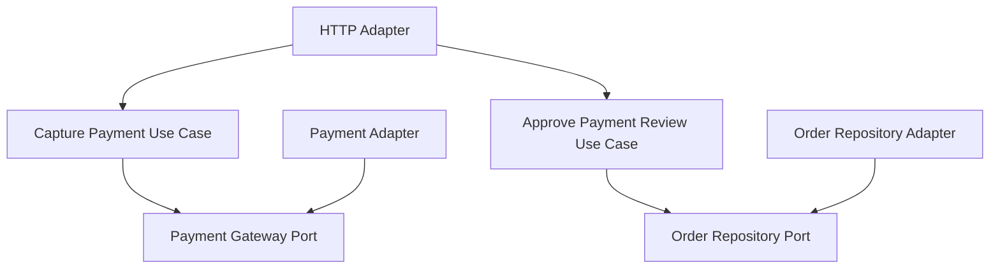

# Lesson 029: Payment Review Workflow

## Objective

Add a real manual-review branch to the payment flow so payment is no longer a binary pass/fail step.

## Theory

Until now, payment capture was effectively a single happy-path transition:

- capture succeeds
- order becomes ready for fulfillment

That was enough to demonstrate an outbound payment port, but it skipped an important workflow shape:

- accepted
- failed
- requires manual review

This lesson introduces the middle branch and makes it explicit in the order state machine.

## Why This Matters Here

Hexagonal Architecture is most useful when the core can absorb new workflow states without transport or infrastructure leakage.

This lesson shows that clearly:

- the payment port returns a business outcome, not just `true/false`
- the domain owns the `PaymentReview` transition
- the application layer adds a new command to approve payment review
- the HTTP adapter exposes the review branch explicitly

## Diagram

## Implementation Focus

Implement:

- a richer `PaymentGateway` result
- `PaymentReview` as an order workflow state
- `ApprovePaymentReviewUseCase`
- an HTTP adapter for payment capture and payment-review approval
- tests proving shipment is blocked until manual review is approved

Deliberately leave for later:

- reviewer rejection path
- reason codes for why review was triggered
- payment history records

## What To Verify

- the project compiles
- capture can move an order into `PaymentReview`
- shipment is blocked during review
- approving review moves the order to `ReadyForFulfillment`
