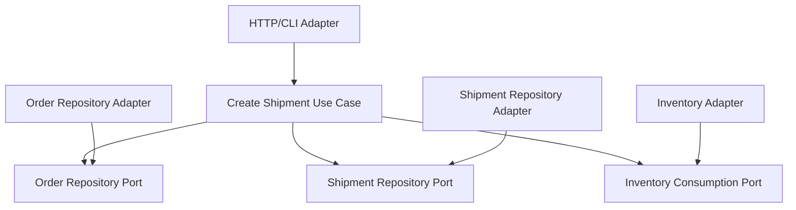

# Lesson 030: Partial Shipment Support

## Objective

Replace the all-or-nothing shipment shortcut with real partial fulfillment behavior.

## Theory

Until now, shipment creation implicitly meant:

- ship every remaining line
- finish the order in one step

That was enough for a first fulfillment slice, but it skipped one of the more interesting state transitions in the canonical model:

- `ReadyForFulfillment -> PartiallyShipped -> Shipped`

This lesson introduces line-level shipped quantities and allows shipment creation to carry an explicit subset of the order.

## Why This Matters Here

Hexagonal Architecture should be able to absorb richer fulfillment rules without pushing transport details into the core.

This lesson makes that visible:

- the domain owns remaining-shippable calculations
- the shipment use case accepts explicit shipment lines
- the order status changes according to line-level progress
- existing adapters can still use the full-shipment default path

## Diagram

## Implementation Focus

Implement:

- shipped quantity tracking on order lines
- `PartiallyShipped` as an order status
- shipment validation against remaining shippable quantity
- explicit shipment-line requests with a fallback to full remaining shipment
- tests proving an order can move from partial to complete shipment

Deliberately leave for later:

- shipment line identifiers
- warehouse-specific allocation
- partial returns against partially shipped orders

## What To Verify

- the project compiles
- a subset shipment leaves the order in `PartiallyShipped`
- a later shipment can complete the order
- over-shipment is rejected by the core rules
