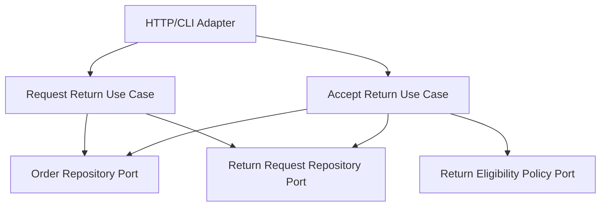

# Lesson 031: Partial Returns By Line

## Objective

Make returns line-selective and quantity-aware instead of assuming every shipped line is always returned in full.

## Theory

Before this lesson, return requests still followed the old all-or-nothing shortcut:

- every eligible line was included
- the full shipped quantity was assumed

That no longer fits once shipment itself is partial. The core now needs to reason about:

- which shipped line is being returned
- how much of it is still returnable
- how accepted returns reduce the remaining returnable quantity

## Why This Matters Here

Hexagonal Architecture is more than ports and adapters. It also needs the core model to stay coherent as workflows get more realistic.

This lesson shows that progression:

- request-return now accepts explicit line requests
- the domain validates return quantity against shipped-minus-returned state
- accepted returns update the order’s returned quantities
- refund/restock still happen through the existing outbound ports

## Diagram

## Implementation Focus

Implement:

- remaining-returnable quantity on order lines
- explicit `ReturnLineRequest` input
- partial return request creation
- accepted-return updates to order returned quantities
- tests proving over-return is rejected

Deliberately leave for later:

- order line identifiers instead of SKU matching
- partial refunds by amount disputes
- damaged-versus-restockable return branching

## What To Verify

- the project compiles
- a partial shipped quantity can be partially returned
- accepted returns reduce the remaining returnable quantity
- over-return is rejected by the core rules
