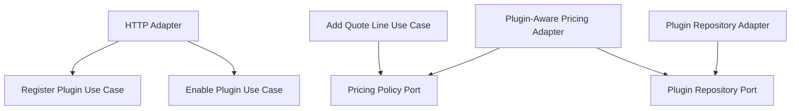

# Lesson 032: Plugin Pricing Extension Point

## Objective

Add a real extension point so enabled plugins can change pricing without changing the quote use case or the domain model structure.

## Theory

Up to now, pricing has been a normal outbound port with one concrete adapter.

That proves replaceability, but not extensibility. A plugin architecture introduces a different idea:

- the core keeps the pricing contract stable
- plugin registrations are managed separately
- enabled plugin contributions are composed by an adapter behind the same pricing port

This lesson uses a narrow but real example: an enabled seasonal pricing plugin that applies an extra discount.

## Why This Matters Here

Hexagonal Architecture benefits from showing not only substitution of adapters, but composition of behavior behind a port.

This lesson makes that explicit:

- plugin registration is its own repository boundary
- application services register and enable plugins
- the pricing adapter consults enabled plugins deterministically
- quote pricing changes without changing quote orchestration

## Diagram

## Implementation Focus

Implement:

- a minimal `PluginRegistration` domain model
- plugin repository port and in-memory adapter
- register, enable, and list plugin use cases
- a plugin-aware pricing adapter that composes enabled pricing plugins
- tests proving an enabled pricing plugin changes quote totals

Deliberately leave for later:

- plugin disable/update configuration
- approval and shipping plugin types
- dynamic plugin loading from external packages

## What To Verify

- the project compiles
- a pricing plugin can be registered and enabled
- enabled pricing plugins affect adjusted unit price
- the HTTP adapter exposes plugin registration and enable/list actions
