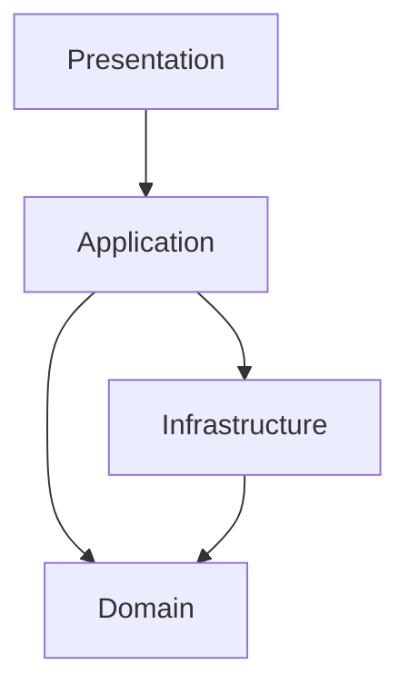

# Lesson 001: Layered Skeleton

## Objective

Introduce the basic layered structure for the application and implement one narrow end-to-end path through it.

## Theory

Layered architecture separates the system by responsibility. The main idea is that UI concerns, application orchestration, business rules, and infrastructure details should not all live in the same place.

For this first lesson, we use four layers:

- presentation
- application
- domain
- infrastructure

Why do this?

- The presentation layer should focus on input/output.
- The application layer should coordinate use cases.
- The domain layer should hold business concepts and rules.
- The infrastructure layer should deal with technical details like storage.

This solves the problem of codebases where every concern is mixed together, making change risky and reasoning slow.

The tradeoff is more indirection. Even for a small feature, you often move through several files.

## Why This Matters Here

We are going to implement the same toy application in several architectures. For the layered version, the first thing we need to make visible is the separation of responsibilities and the top-down dependency flow.

## Diagram

## Implementation Focus

Implement one simple flow:

- create a draft quote

The code should show:

- presentation calling an application service
- application service coordinating the use case
- domain owning the `Quote` concept
- infrastructure storing quotes in memory

Do not add more features yet.

## What To Verify

- the project compiles
- the demo path can create a draft quote
- the layer boundaries are visible in the folder structure and code
