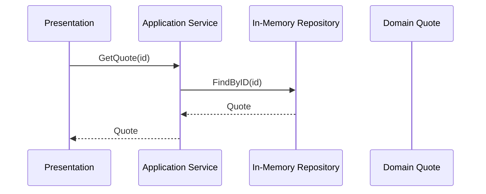

# Lesson 002: Application Service Read Flow

## Objective

Extend the layered skeleton with a second use case: retrieve a quote by ID through the same layers.

## Theory

In layered architecture, the application layer should expose use cases, not only write operations. A read flow still matters because it shows that presentation code should not reach directly into storage.

Why do this?

- It keeps presentation code free from infrastructure details.
- It gives the application layer control over use-case boundaries.
- It makes repository contracts explicit instead of accidental.

This solves the problem where reads bypass the application layer and the architecture slowly collapses into direct data access from everywhere.

The tradeoff is that even simple reads may feel indirect because they still pass through the application service.

## Why This Matters Here

Lesson 001 proved the layered structure for one write path. Lesson 002 proves that reads also respect the same boundaries, which makes the application layer look like an actual use-case surface instead of a one-off command handler.

## Diagram

## Implementation Focus

Implement:

- a repository read method
- an application service read use case
- a demo flow that creates a quote and then retrieves it

Do not add listing, updates, or approval logic yet.

## What To Verify

- the project compiles
- the demo path creates a quote and retrieves it by ID
- presentation still depends on the application layer rather than on infrastructure directly
