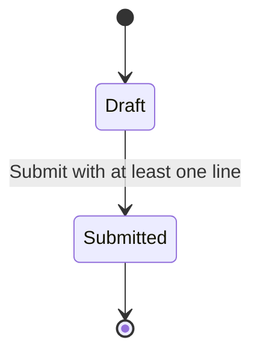

# Lesson 003: Domain State Transition

## Objective

Move a real business rule into the domain layer by allowing a draft quote to accept lines and then be submitted.

## Theory

In layered architecture, the domain layer should not be only a bag of fields. It should own core business rules when those rules belong to the business concept itself.

Here we let the `Quote` decide:

- how a line is added
- when submission is allowed
- how its status changes

Why do this?

- It keeps business rules close to the business object.
- It stops the application layer from becoming the place where every rule is hand-coded procedurally.
- It makes state transitions explicit instead of accidental.

This solves the problem where status changes happen from anywhere, with no single place protecting the rules.

The tradeoff is that the domain model becomes a little richer, so some behavior moves out of simple orchestration code and into domain methods.

## Why This Matters Here

So far, the layered solution proves structure, but not much business behavior. This lesson makes the domain layer visibly useful by giving `Quote` a lifecycle rule.

## Diagram

## Implementation Focus

Implement:

- quote lines in the domain model
- a domain rule for adding a line
- a domain rule for submitting a quote
- application-service methods that orchestrate those domain operations

Do not add approval logic yet.

## What To Verify

- the project compiles
- the demo path creates a draft quote, adds a line, and submits it
- submission is performed through the domain model rather than by directly setting a status in the application layer
