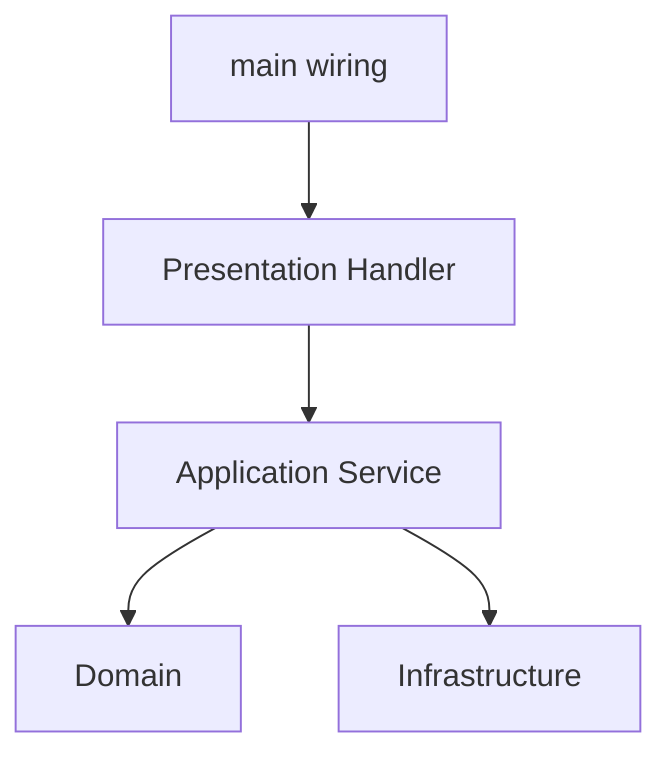

# Lesson 004: Presentation Layer

## Objective

Make the presentation layer explicit by moving demo orchestration and output formatting out of `main` and into a dedicated presentation component.

## Theory

In layered architecture, the presentation layer should translate user-facing interaction into application use cases and translate results back into something displayable.

Why do this?

- It prevents `main` or transport entrypoints from turning into ad hoc use-case code.
- It keeps formatting and interaction concerns out of the application layer.
- It makes the layered separation visible in a more realistic way.

This solves the problem where entrypoint code quietly becomes the place where orchestration, formatting, and business flow all mix together.

The tradeoff is another thin layer of indirection. For very small demos it can feel like ceremony, but it pays off once multiple entrypoints or output formats appear.

## Why This Matters Here

So far the layered architecture has domain and application separation, but presentation is still implicit inside `main`. This lesson makes the top layer concrete so the architecture is easier to recognize.

## Diagram

## Implementation Focus

Implement:

- a presentation package for the quote demo
- a handler that runs the existing flow through the application service
- response formatting inside the presentation layer instead of in `main`

Do not add HTTP or a second UI yet.

## What To Verify

- the project compiles
- the demo still runs end to end
- `main` only wires dependencies and invokes the presentation layer
