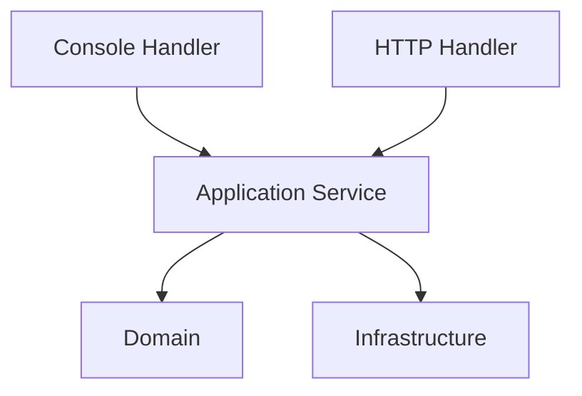

# Lesson 005: HTTP Presentation Adapter

## Objective

Add a second presentation path by introducing a small HTTP adapter that uses the same application service as the console presentation.

## Theory

In layered architecture, the presentation layer is not a single UI file. It is the place where external interaction is translated into application use cases.

Why do this?

- It shows that the application layer can serve more than one entrypoint.
- It keeps transport concerns like HTTP request parsing and response formatting out of the application and domain layers.
- It makes the presentation layer feel like a real boundary instead of only a console demo.

This solves the problem where the first delivery mechanism quietly defines the whole architecture.

The tradeoff is repetition at the edge. Each presentation path needs its own translation logic, even when the underlying use cases are shared.

## Why This Matters Here

The layered architecture is clearer once two presentation adapters use the same application service. That makes the role of the application layer much easier to see.

## Diagram

## Implementation Focus

Implement:

- an HTTP presentation package
- one endpoint to create a draft quote
- one endpoint to fetch a quote by ID
- tests for the HTTP handler using the existing application service

Do not add a full HTTP server binary or approval endpoints yet.

## What To Verify

- the project compiles
- the HTTP handler can create a draft quote
- the HTTP handler can fetch an existing quote
- the same application service is reused by both console and HTTP presentation paths
