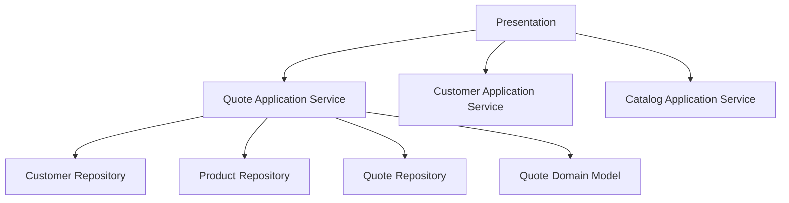

# Lesson 006: Canonical Quote Inputs

## Objective

Move the layered example closer to the real sample application by making quotes depend on actual customers and products instead of loose strings.

## Theory

The earlier lessons proved the basic shape of layered architecture. That was useful, but it was still a skeleton.

The canonical application is not "a quote with a product name." It is a quote created for a customer and composed from catalog products. That distinction matters because:

- the application layer now has to coordinate multiple repositories
- the domain starts preserving business snapshots instead of raw ad hoc input
- the presentation layer stops inventing product data on the fly

This solves the problem where an architecture demo looks clean only because the domain is too fake.

The tradeoff is more ceremony. Even a small use case now needs supporting services and seed data.

## Why This Matters Here

Layered architecture becomes more interesting once one application service depends on other business concepts. This is where the service layer starts showing orchestration rather than just pass-through CRUD.

## Diagram

## Implementation Focus

Implement:

- a `Customer` model and repository
- a `Product` model and repository
- small application services to create customers and products
- quote creation that verifies the customer exists and is active
- quote line creation that loads a product by SKU and snapshots its commercial identity into the quote

Do not implement pricing, inventory reservation, or approval policy yet.

## What To Verify

- the project compiles
- a customer must exist before a quote can be created
- a product must exist before a quote line can be added
- quote lines store `sku` plus a product-name snapshot
- the console demo still runs through the application layer only
