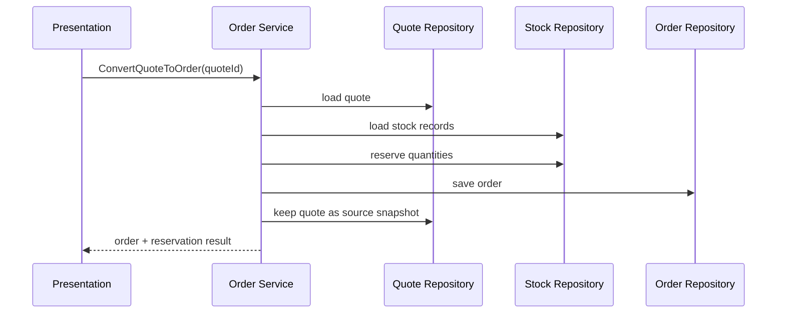

# Lesson 007: Order Conversion and Reservation

## Objective

Add the first real cross-aggregate workflow: convert a submitted quote into an order and reserve inventory before the order is committed.

## Theory

This is where the application layer starts earning its existence.

Creating a quote was mostly about coordinating one aggregate plus lookup data. Converting a quote into an order is different because one business action now has to coordinate:

- the quote
- stock records
- the new order

Why do this?

- it shows that the service layer is responsible for workflow orchestration
- it keeps reservation logic out of presentation code
- it makes transaction-shaped thinking visible even in a small in-memory example

This solves the problem where layered architecture looks clean only because every use case touches one table-like object.

The tradeoff is that application services can become procedural if too much business logic stays there. We accept that risk for now so the orchestration boundary is easy to see.

## Why This Matters Here

The canonical sample application is about quote-to-order flows, inventory reservation, and later payment and shipping. This lesson is the first step where the layered implementation starts resembling that real workflow.

## Diagram

## Implementation Focus

Implement:

- a `StockRecord` domain model and repository
- an `Order` domain model and repository
- inventory receiving in the application layer
- quote-to-order conversion with stock availability checks
- reservation updates before the order is saved

Keep it simple:

- submitted quotes are considered convertible
- reservation failure rejects conversion
- payment and shipment come later

## What To Verify

- the project compiles
- stock can be received for a product
- converting a submitted quote creates an order
- converting a quote reserves stock
- conversion fails when stock is insufficient
