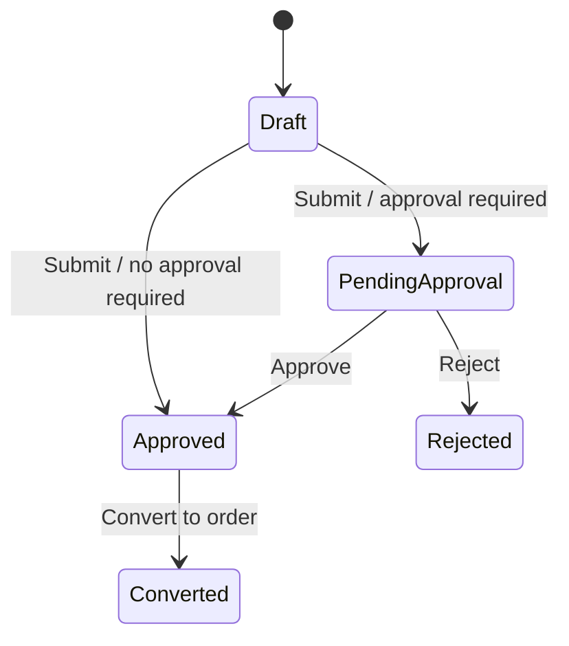

# Lesson 008: Quote Approval Boundary

## Objective

Make quote-to-order conversion depend on approval state instead of plain submission.

## Theory

Submission and approval are not the same business action.

If a layered implementation treats "submitted" as automatically convertible, it hides an important workflow boundary from the sample application. The system needs a place where:

- submission evaluates whether approval is required
- approval changes business eligibility
- order conversion refuses ineligible quotes

Why do this?

- it makes a real lifecycle visible in the domain model
- it gives the application layer a meaningful orchestration step before order creation
- it prepares the codebase for richer policy logic later

This solves the problem where order conversion depends on a vague status instead of a real business decision.

The tradeoff is more state and more branching. That is acceptable because the sample app is intentionally about workflow and policy, not just CRUD.

## Why This Matters Here

The canonical docs distinguish `Draft`, `PendingApproval`, `Approved`, and `Rejected`. This lesson introduces that distinction in the layered variant using a simple approval rule: quotes containing `CustomBuild` products require manager approval.

## Diagram

## Implementation Focus

Implement:

- richer quote statuses
- quote submission that evaluates a simple approval rule
- explicit approve and reject operations
- order conversion that requires approved quotes

Keep it small:

- `CustomBuild` means approval required
- no separate approval-request aggregate yet
- no manager comments or reason codes yet

## What To Verify

- the project compiles
- standard quotes become `Approved` when submitted
- `CustomBuild` quotes become `PendingApproval` when submitted
- pending quotes cannot convert to orders
- approved quotes can convert to orders
