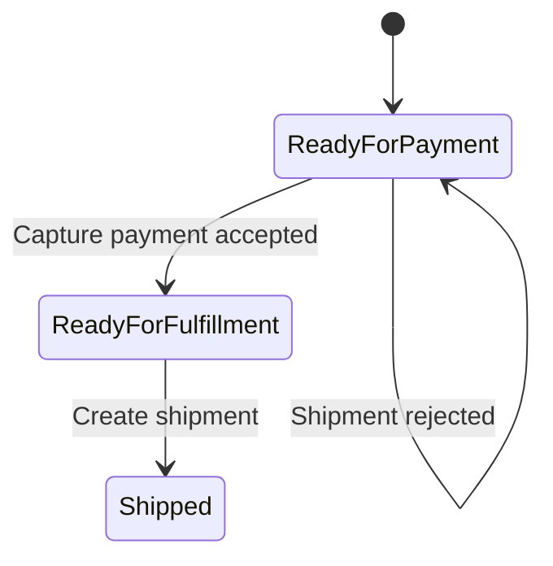

# Lesson 009: Payment and Shipment Gate

## Objective

Add payment capture and block shipment until payment is accepted.

## Theory

This lesson adds another workflow boundary that a CRUD-shaped system would usually hide.

An order is not automatically shippable just because it exists. There is a business dependency between:

- order creation
- payment acceptance
- shipment authorization

Why do this?

- it shows the application layer coordinating a sequence of stateful business operations
- it keeps fulfillment policy out of transport code
- it makes the order lifecycle more realistic and closer to the canonical sample application

This solves the problem where fulfillment would otherwise ignore a central business rule.

The tradeoff is additional state on the order plus another service boundary. That is the right tradeoff here because the sample app is explicitly about workflow and policy.

## Why This Matters Here

The canonical application says shipment cannot happen before payment is accepted unless special customer terms apply. This lesson introduces the simpler first half of that rule: shipment is blocked until payment is accepted.

## Diagram

## Implementation Focus

Implement:

- payment state on the order
- a payment application service that marks payment accepted
- a shipment aggregate and repository
- a fulfillment service that creates a shipment only when the order is ready

Keep it simple:

- accepted payment only
- full shipment only
- reserved stock is consumed when shipment succeeds

## What To Verify

- the project compiles
- a converted order starts in `ReadyForPayment`
- payment capture moves the order to `ReadyForFulfillment`
- shipment fails before payment is accepted
- shipment succeeds after payment is accepted
