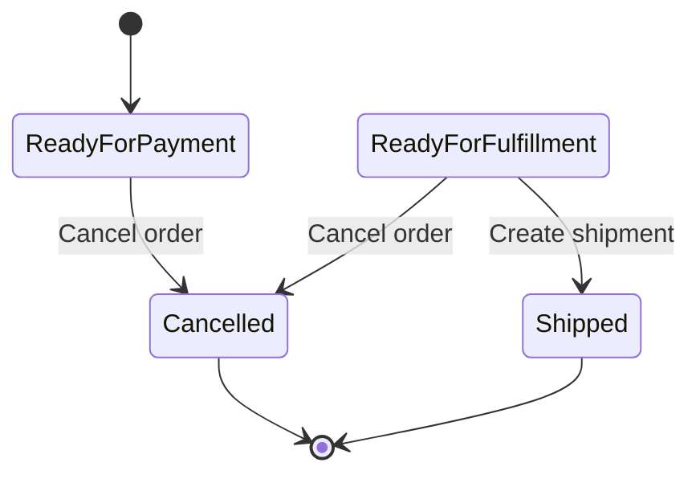

# Lesson 010: Cancellation and Reservation Release

## Objective

Add order cancellation before shipment and release reserved stock when cancellation succeeds.

## Theory

Real workflows are not only forward-moving. They also need controlled reversal paths.

Once the layered example can create orders, capture payment, and ship them, the next obvious question is: what happens when the customer changes their mind before shipment?

Why do this?

- it shows that the application layer must coordinate undo-style workflows too
- it makes inventory consistency visible in both forward and reverse directions
- it surfaces an important business boundary: cancellation before shipment is allowed, after shipment it is not

This solves the problem where reservations would stay locked forever or cancellation would ignore fulfillment state.

The tradeoff is more branching in the order lifecycle. That is acceptable because the sample application is specifically about state transitions and policy gates.

## Why This Matters Here

The canonical sample app requires cancellation before shipment and inventory release on cancellation. This lesson introduces that rule in the layered variant without adding returns yet.

## Diagram

## Implementation Focus

Implement:

- order cancellation in the domain model
- application orchestration to release reserved stock
- rejection of cancellation after shipment
- one demo path that shows reservation release

Keep it small:

- no refund workflow yet
- cancellation is full-order only
- only reserved quantities are released

## What To Verify

- the project compiles
- cancelling an unshipped order sets status to `Cancelled`
- cancelling an unshipped order releases reserved stock
- cancelling a shipped order fails
