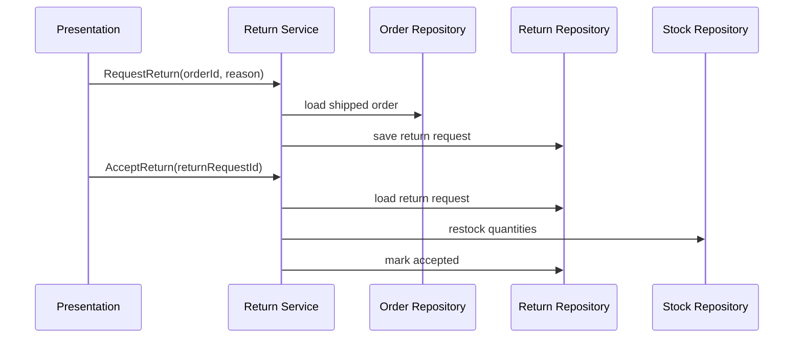

# Lesson 011: Returns and Restocking

## Objective

Add a simple return workflow for shipped orders and restock inventory when the return is accepted.

## Theory

Returns are another reversal workflow, but they are not the same as cancellation.

Cancellation happens before shipment and releases reserved stock. Returns happen after shipment and add stock back after eligibility is checked.

Why do this?

- it shows another application-layer workflow that spans multiple repositories
- it makes the business distinction between cancellation and returns concrete
- it introduces snapshot-based policy decisions, because return eligibility should depend on what was sold, not only on the current catalog state

This solves the problem where post-shipment corrections would otherwise have no place in the model.

The tradeoff is more lifecycle state and another aggregate. That is the right tradeoff because the canonical sample application explicitly includes returns.

## Why This Matters Here

The canonical docs require that clearance items cannot be returned and that accepted returns adjust inventory. This lesson introduces those behaviors in a narrow but visible form.

## Diagram

## Implementation Focus

Implement:

- a `ReturnRequest` aggregate
- request and accept return use cases
- a return eligibility rule blocking `Clearance` products
- inventory restocking on accepted returns

Keep it small:

- full-order return only
- accepted or rejected at request time based on basic rules
- no refund workflow yet

## What To Verify

- the project compiles
- shipped standard items can be returned
- accepted returns restock inventory
- clearance items cannot be returned
