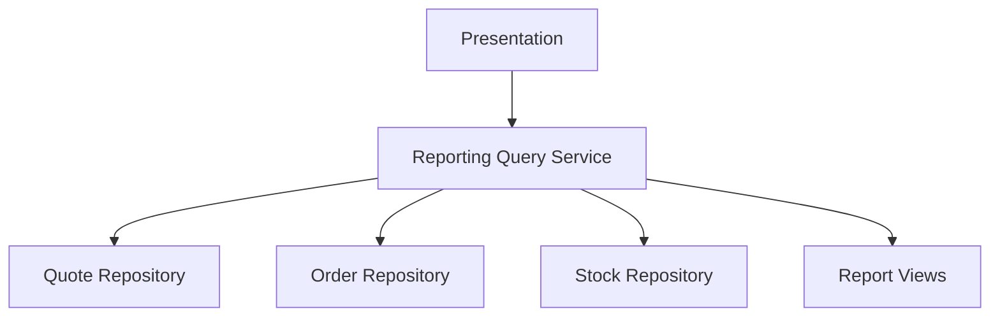

# Lesson 012: Reporting Query Service

## Objective

Add a dedicated query-side service for reporting so read concerns stop piggybacking on the command services.

## Theory

By this point the layered example has a growing set of write-side workflows:

- quote creation and approval
- order conversion
- payment
- shipment
- cancellation
- returns

If reporting is mixed into those same services, they become a grab bag of commands and queries. A layered system usually stays clearer when read concerns have their own query-oriented service.

Why do this?

- it separates workflow orchestration from reporting reads
- it makes query models visible without requiring full CQRS
- it shows that even in layered architecture, reads often want different shapes than writes

This solves the problem where the application layer slowly turns into one large service with no distinction between "do work" and "read summaries."

The tradeoff is another service and extra view types. That is worthwhile because the canonical sample application explicitly includes reporting concerns.

## Why This Matters Here

The canonical docs call out low stock items, quotes awaiting approval, and quote conversion reporting. This lesson introduces those concerns using direct repository reads and small report views, which is a natural first reporting style in layered architecture.

## Diagram

## Implementation Focus

Implement:

- repository list operations for reporting reads
- a `ReportingQueryService`
- low stock reporting
- quotes awaiting approval reporting
- quote conversion reporting

Keep it simple:

- direct repository queries, not projections
- small view structs, not domain entities
- no persistence optimization yet

## What To Verify

- the project compiles
- reporting reads are available without mutating state
- pending approval quotes appear in the approval report
- low stock items appear in the low stock report
- quote conversion metrics reflect converted vs total quotes
