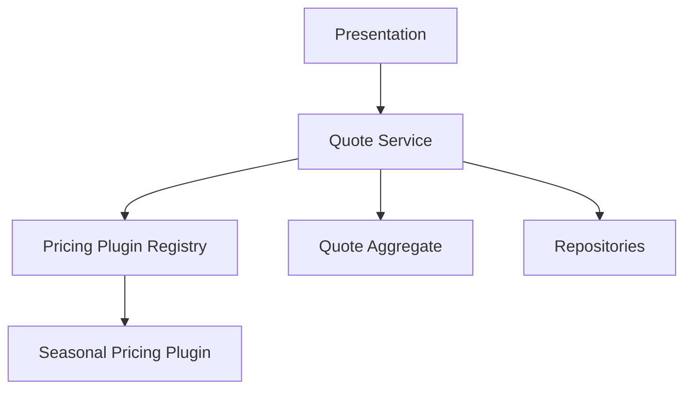

# Lesson 013: Pricing Plugin Extension

## Objective

Add a simple pricing plugin hook so quote line pricing can be extended without changing the core quote workflow.

## Theory

Extensibility is not only about loading code dynamically. The first architectural question is simpler:

- where does optional business behavior plug into the flow?
- who decides which extensions are active?
- how does the core workflow stay stable while the behavior changes?

In layered architecture, the usual answer is that the application service orchestrates the extension point and the infrastructure layer provides the concrete plugin registry.

Why do this?

- it makes a real extension seam visible
- it shows that the core quote workflow can stay stable while pricing behavior changes
- it prepares the codebase for richer rule or plugin styles later

This solves the problem where every new pricing rule would otherwise require editing the quote use case directly.

The tradeoff is more indirection. That is acceptable here because the sample application explicitly includes pluggable behavior.

## Why This Matters Here

The canonical docs require at least one extension point where plugins can influence business behavior. This lesson introduces that through pricing adjustments applied during quote line creation.

## Diagram

## Implementation Focus

Implement:

- base and adjusted pricing on quote lines
- a pricing plugin contract
- an infrastructure-backed plugin registry
- one sample plugin that adds a pricing adjustment

Keep it small:

- static in-process plugins only
- pricing plugins only
- plugin output is applied during `AddQuoteLine`

## What To Verify

- the project compiles
- quote lines include pricing data
- a registered pricing plugin changes the adjusted price
- the core quote workflow still works without changing command semantics
