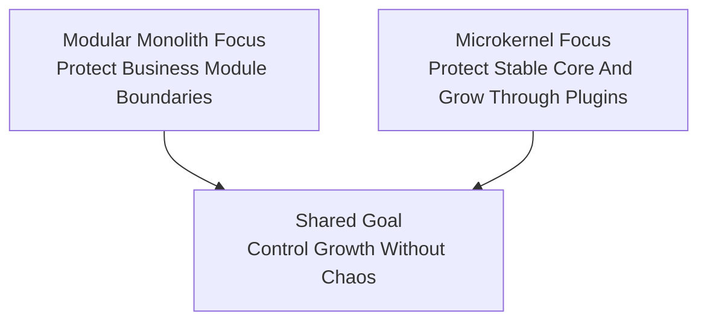

# Lesson 000: From Modular Monolith To Microkernel

## Objective

Explain how Microkernel / Plugin Architecture differs from Modular Monolith, where they overlap, and why it is worth studying Microkernel next.

## Short Answer

Modular Monolith and Microkernel both care about internal structure, but they optimize for different things.

Modular Monolith asks:

- how do we keep one deployable split into strong business modules?
- how do modules talk to each other through narrow APIs?

Microkernel asks a different question:

- what should stay in the stable core?
- what should be a plugin?
- how does the system grow by adding or replacing capabilities around that core?

So this is not just a rename of modules.

It changes the architectural pressure from:

- protect module autonomy inside one codebase

to:

- protect a stable core while allowing capability growth through plugins

## How They Are Related

Both architectures can still run in one process and one deployable.

Both can still use:

- domain types
- repositories
- services
- in-memory adapters

But the organizing idea changes.

In the Modular Monolith track, the main question was:

- which module owns this behavior?

In the Microkernel track, the main question becomes:

- should this behavior live in the kernel or in a plugin?

That is a meaningful shift.

## Diagram

## What Changes In Emphasis

The biggest change is that the stable core becomes first-class.

The kernel should stay responsible for things such as:

- plugin registration
- capability discovery
- stable extension contracts

Plugins should stay responsible for:

- business capabilities
- optional behavior
- feature growth around the kernel

That means the code will start asking:

- which contracts belong to the kernel?
- which capabilities are discoverable?
- how does one plugin depend on another without collapsing into direct shared ownership?

## What Microkernel Solves Better In This Comparison

This architecture becomes more useful when the educational pressure is:

"How do we make extensibility itself a first-class architectural concern?"

That is different from the Modular Monolith pressure.

### 1. Extensibility Becomes The Main Story

Instead of treating plugin behavior as one lesson near the end, Microkernel makes extension part of the architecture from the beginning.

### 2. The Stable Core Becomes Explicit

The architecture forces an answer to:

- what absolutely must stay central and stable?

That is a useful discipline.

### 3. Capability Discovery Matters

Instead of wiring everything as peer modules, the design starts to care about:

- registration
- resolution
- plugin boot order
- stable plugin-facing contracts

That creates a different kind of architectural clarity.

## What Modular Monolith Solved Better

Modular Monolith was stronger when the main goal was:

- business ownership inside one codebase

That made it excellent for:

- business module boundaries
- internal autonomy
- cross-module workflows

Microkernel can still represent business capabilities, but its main vocabulary is different.

It leads more naturally with:

- kernel
- plugin
- extension point

than with:

- business module

## Questions A Student Might Naturally Ask

### "Is Microkernel only for IDEs or plugin-heavy products?"

No.

Those are famous examples, but the pattern is still useful any time extensibility is a major architectural concern.

### "Can a Microkernel still be a monolith?"

Yes.

This track will still start as one deployable.

The difference is not distribution first.

The difference is how growth is organized.

### "Is this just Modular Monolith with a plugin folder?"

No.

The difference matters only if the kernel becomes a real stable core and plugins depend on kernel-owned extension seams rather than behaving like ordinary peer modules.

## What Will Change In The Upcoming Lessons

Compared with the Modular Monolith track, expect these elements to become visible much earlier:

- a kernel package
- plugin registration
- kernel-owned extension contracts
- business capabilities exposed through plugins
- resolution of capabilities through the kernel rather than ordinary module-to-module wiring

The business workflows will still feel familiar.

The new lesson is about making extension structure visible from the start.

## Summary

Moving from Modular Monolith to Microkernel is not a rejection of module boundaries.

It is a change in the main architectural pressure.

Modular Monolith asked:

- how do we keep one codebase split into strong business capabilities?

Microkernel asks:

- how do we keep a stable core while letting capabilities grow around it as plugins?

That is why this track is worth doing next.
