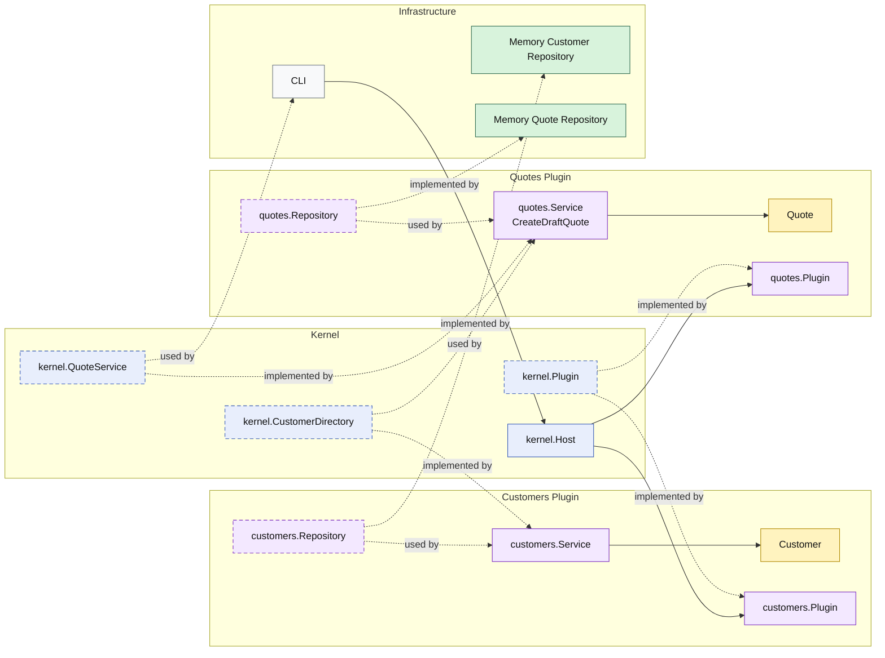

# Lesson 001: Microkernel Skeleton

## Objective

Build the first runnable slice of the application in Microkernel / Plugin Architecture and make the stable kernel plus plugin boundary visible through a `customers` plugin and a `quotes` plugin.

## Theory

Microkernel Architecture keeps a small stable core and lets features grow around it as plugins.

The key idea is:

- the kernel owns plugin registration and stable extension contracts
- plugins implement business capabilities
- plugins discover other capabilities through the kernel instead of acting like ordinary peer modules

This solves a different problem from the Modular Monolith skeleton.

The Modular Monolith lesson asked:

- how do we make business modules explicit?

This lesson asks:

- what belongs in the stable core?
- what should be a plugin?
- how does one plugin consume another capability without collapsing back into direct ownership?

The tradeoff is that the kernel must stay disciplined.

If every business concept moves into the kernel, the architecture loses its point.

## Why This Matters Here

For this repository, the first Microkernel lesson should make one thing unmistakable:

- the kernel owns registration and capability discovery
- the `customers` plugin provides customer validation capability
- the `quotes` plugin provides draft quote creation capability
- the `quotes` plugin gets customer validation through the kernel, not from customer storage and not from direct module wiring in `main`

That is the first meaningful difference from the Modular Monolith baseline.

## Diagram

Legend:

- blue: kernel-owned type or contract
- purple: plugin-owned service, repository contract, or plugin registration type
- yellow: domain type
- green: data adapter
- gray: framework edge
- dashed border: contract
- dashed arrow: structural relationship such as `used by` or `implemented by`

## Implementation Focus

Implement one simple flow:

- create a draft quote

The code should show:

- a kernel that owns plugin registration and capability discovery
- a `customers` plugin that exposes customer validation
- a `quotes` plugin that exposes draft quote creation
- in-memory repositories wired from the outside
- one CLI demo that boots the kernel, registers plugins, and exercises the plugin capability

Do not add quote lines, approvals, or reporting yet.

## What To Verify

- the project compiles
- `go test ./...` passes
- the demo can create a draft quote
- the `quotes` plugin gets customer validation capability from the kernel rather than from direct storage access
