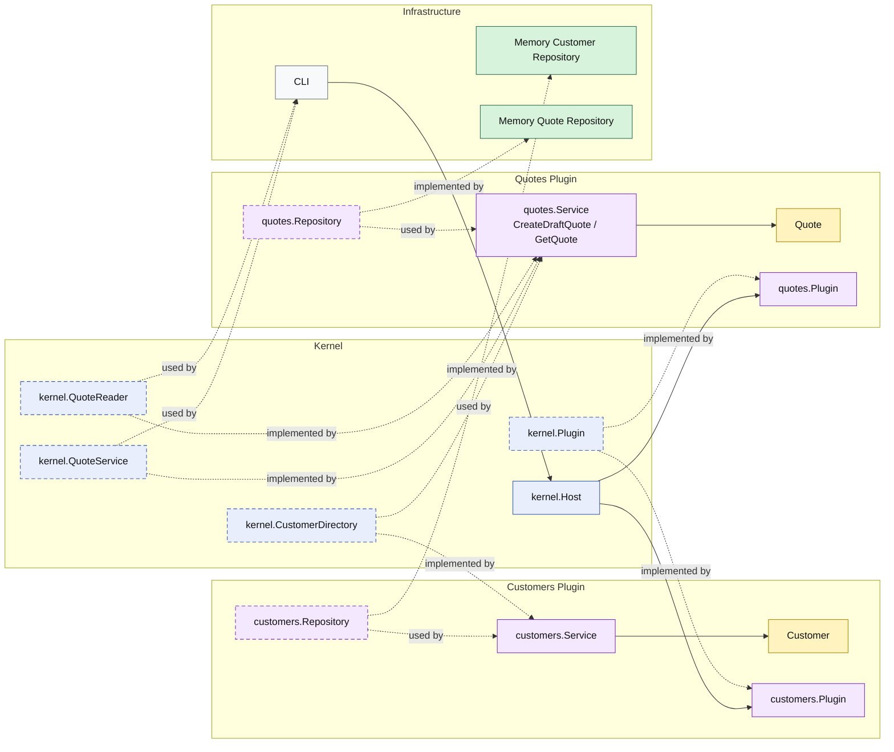

# Lesson 002: Quote Query Through Kernel Capability

## Objective

Add the first read capability to the Microkernel track so quote lookup also flows through a kernel-owned extension contract rather than through direct repository access.

## Theory

The first lesson proved that a plugin can expose a command capability through the kernel.

That is useful, but incomplete.

A real microkernel does not only need:

- plugin registration
- command-style workflow capabilities

It also needs a way to expose read capabilities through stable kernel contracts.

This lesson introduces that next idea:

- the kernel owns a `QuoteReader` contract
- the `quotes` plugin implements it
- callers ask the kernel for quote lookup capability instead of reading plugin storage directly

This solves an important architectural problem:

- once a plugin is registered, callers should depend on stable kernel-facing capabilities, not on internal plugin repositories

The tradeoff is that the kernel contract surface grows.

That is acceptable only if the kernel keeps owning extension seams, not business details.

## Why This Matters Here

For this repository, the next Microkernel lesson should make one thing clear:

- the `quotes` plugin does not only create quotes
- it also exposes quote lookup through the kernel
- the outside world still talks to the kernel capability, not to quote storage

That keeps the plugin boundary real on both the write side and the read side.

## Diagram

Legend:

- blue: kernel-owned type or contract
- purple: plugin-owned service, repository contract, or plugin registration type
- yellow: domain type
- green: data adapter
- gray: framework edge
- dashed border: contract
- dashed arrow: structural relationship such as `used by` or `implemented by`

## Implementation Focus

Implement one simple query flow:

- load a quote by id through the kernel

The code should show:

- a kernel-owned `QuoteReader` contract
- the `quotes` plugin implementing both write and read capability
- the CLI using the kernel to create and then reload the quote

Do not add quote lines, approvals, or multiple read filters yet.

## What To Verify

- `go test ./...` passes
- the demo can create a draft quote
- the demo can load that quote again through the kernel read capability
- the CLI still does not access the quote repository directly
