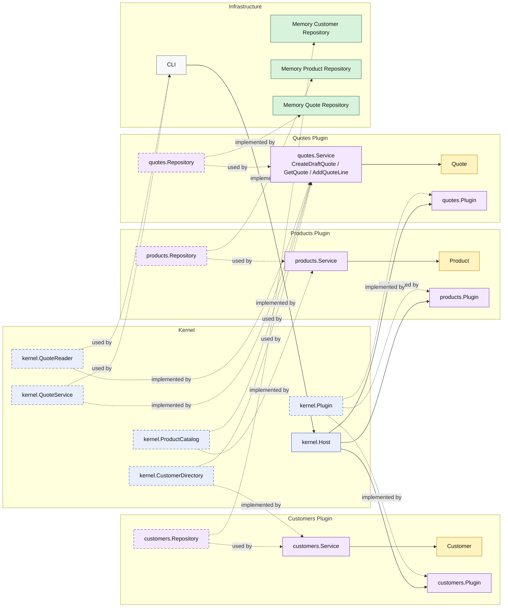

# Lesson 003: Add Quote Line With Product Plugin

## Objective

Add the first multi-plugin workflow so the `quotes` plugin can load product data through a kernel-owned product capability and mutate an existing quote.

## Theory

The first two lessons established a basic microkernel shape:

- the kernel owns plugin registration
- the kernel owns stable extension contracts
- the `quotes` plugin exposes command and query capabilities through the kernel

That proves the shell of the architecture, but not a realistic workflow.

A stronger microkernel lesson needs a plugin to consume another business capability through the kernel.

This lesson introduces that next step:

- the kernel owns a `ProductCatalog` contract
- the `products` plugin implements it
- the `quotes` plugin resolves that capability through the kernel
- adding a quote line depends on product data exposed by another plugin, not on direct repository access

This solves an important architectural problem:

- plugins should collaborate through kernel-owned extension seams instead of bypassing the kernel and coupling directly to one another's internals

The tradeoff is that the kernel now carries another stable capability contract.

That is acceptable only if the kernel still owns seams, not product business rules themselves.

## Why This Matters Here

For this repository, the next Microkernel lesson should make one thing clear:

- quote editing is no longer a single-plugin workflow
- product lookup is a separate plugin capability
- the `quotes` plugin still collaborates through the kernel rather than through direct cross-plugin storage access

That is the first real business workflow that makes the microkernel style visible instead of merely theoretical.

## Diagram

Legend:

- blue: kernel-owned type or contract
- purple: plugin-owned service, repository contract, or plugin registration type
- yellow: domain type
- green: data adapter
- gray: framework edge
- dashed border: contract
- dashed arrow: structural relationship such as `used by` or `implemented by`

## Implementation Focus

Implement one simple edit flow:

- add a line to an existing draft quote

The code should show:

- a kernel-owned `ProductCatalog` contract
- a `products` plugin exposing product lookup
- the `quotes` plugin consuming that capability through the kernel
- the quote read surface showing that the line was added

Do not add submission or approval yet.

## What To Verify

- `go test ./...` passes
- the demo can create a draft quote
- the demo can add a line using product data exposed by the `products` plugin
- reloading the quote shows the new line count and total items
- the `quotes` plugin still does not access product storage directly
