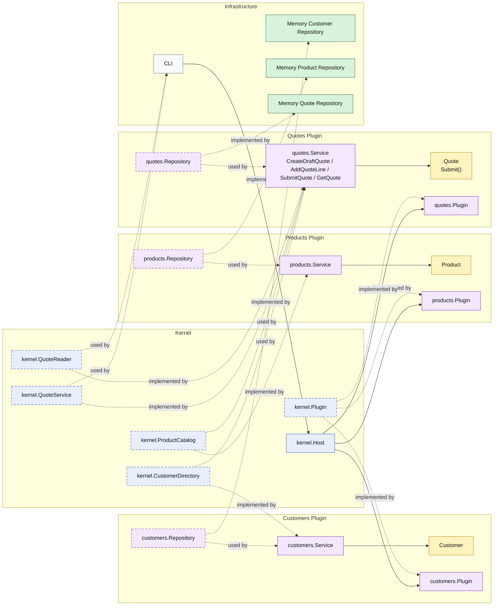

# Lesson 004: Submit Quote State Transition

## Objective

Make quote submission an explicit lifecycle rule inside the `quotes` plugin instead of treating status as only passive data.

## Theory

The previous lesson proved that the `quotes` plugin can coordinate with another plugin through the kernel to edit a draft quote.

That is useful, but it still leaves an important modeling gap:

- when does a draft stop being editable?
- what makes a quote submittable?
- where should that lifecycle rule live?

This lesson introduces the next architectural idea:

- the `quotes` plugin still exposes submission through the kernel
- but the actual submission rule belongs to the `Quote` entity inside the plugin

That matters because Microkernel Architecture is not only about plugin registration.

It still needs each plugin to protect its own business invariants.

So the kernel should own:

- extension seams
- capability discovery

while the plugin should still own:

- its own lifecycle rules
- its own state transition behavior

This solves an important architectural problem:

- exposing a capability through the kernel should not flatten plugin business behavior into procedural status updates

The tradeoff is that plugin services become coordinators around richer plugin-owned behavior instead of being only thin wrappers over storage.

## Why This Matters Here

For this repository, the next Microkernel lesson should make one thing clear:

- a quote can only be submitted from `Draft`
- a quote with no lines cannot be submitted
- once submitted, it is no longer editable
- the CLI still reaches that behavior through the kernel contract

That keeps the microkernel structure and the business rule both visible at the same time.

## Diagram

Legend:

- blue: kernel-owned type or contract
- purple: plugin-owned service, repository contract, or plugin registration type
- yellow: plugin-owned domain type
- green: data adapter
- gray: framework edge
- dashed border: contract
- dashed arrow: structural relationship such as `used by` or `implemented by`

## Implementation Focus

Implement one lifecycle flow:

- submit a quote

The code should show:

- a kernel-level submit command on `QuoteService`
- a `Quote.Submit()` rule inside the `quotes` plugin
- submission blocked when the quote has no lines
- adding more lines blocked after submission

Do not add approval policy yet.

## What To Verify

- `go test ./...` passes
- the demo can create a draft quote
- the demo can add a line and submit the quote
- reloading the quote shows the submitted status
- trying to edit a submitted quote is rejected in tests
