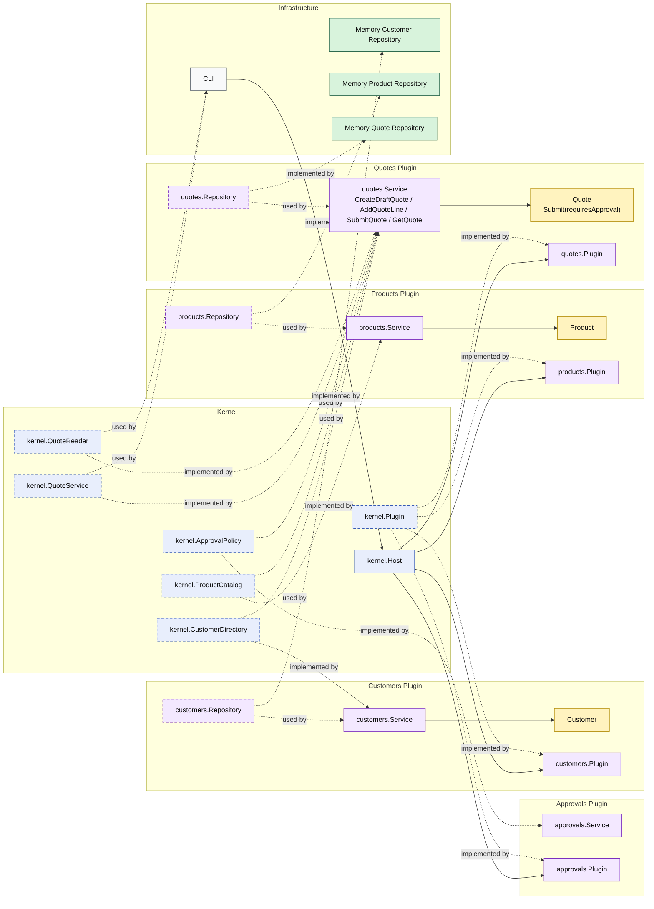

# Lesson 005: Approval Policy Plugin

## Objective

Introduce the first external policy seam in the Microkernel track so quote submission still belongs to the `quotes` plugin, but the decision about whether approval is required comes from a separate plugin capability.

## Theory

The previous lesson made submission a real lifecycle transition inside the `quotes` plugin.

That was important, but it still assumed the submission outcome was fully local:

- every valid draft became `Submitted`

This lesson introduces a more realistic architectural pressure:

- some quotes should go straight through
- some quotes should stop for approval

In Microkernel terms, that is a useful distinction because it separates:

- plugin-owned lifecycle behavior

from:

- plugin-external policy evaluation

So this lesson introduces:

- a kernel-owned `ApprovalPolicy` contract
- an `approvals` plugin that implements it
- a policy-aware `Quote.Submit(requiresApproval bool)` rule inside the `quotes` plugin

This solves an important architectural problem:

- the `quotes` plugin should still own the transition
- but the approval decision itself should be replaceable through a kernel extension seam

The tradeoff is that submission now coordinates one more capability, which makes plugin registration and capability discovery more central to the workflow.

## Why This Matters Here

For this repository, the next Microkernel lesson should make one thing clear:

- submission is still a `quotes` plugin capability
- but whether submission ends in `Approved` or `PendingApproval` is no longer hard-wired inside `quotes`
- the approval rule comes from a separate plugin

That keeps the kernel seam honest and makes extension more than a storage or query story.

## Diagram

Legend:

- blue: kernel-owned type or contract
- purple: plugin-owned service, repository contract, or plugin registration type
- yellow: plugin-owned domain type
- green: data adapter
- gray: framework edge
- dashed border: contract
- dashed arrow: structural relationship such as `used by` or `implemented by`

## Implementation Focus

Implement one policy-aware submission flow:

- submit a quote with an external approval rule

The code should show:

- a kernel-owned `ApprovalPolicy` contract
- an `approvals` plugin implementing that contract
- the `quotes` plugin consulting that capability through the kernel
- a quote ending in `Approved` or `PendingApproval` based on plugin-provided policy

Do not add explicit approval action yet.

## What To Verify

- `go test ./...` passes
- the demo can submit a standard quote straight to `Approved`
- a custom-build quote becomes `PendingApproval`
- the `quotes` plugin still does not own the approval rule directly
