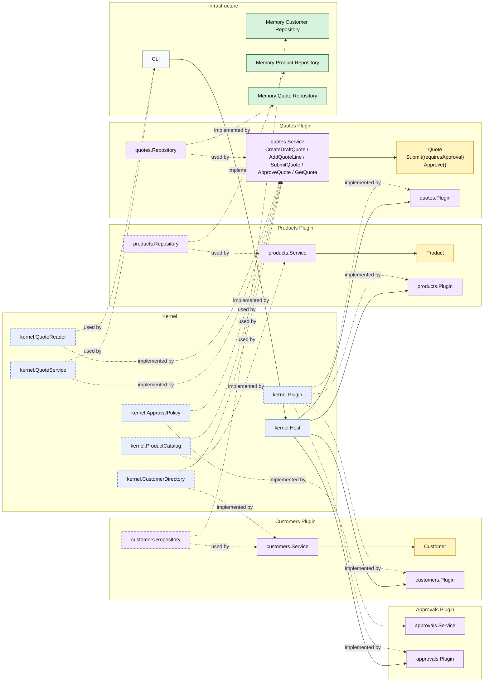

# Lesson 006: Approve Pending Quote

## Objective

Turn `PendingApproval` into a real workflow state by adding an explicit approval action inside the `quotes` plugin.

## Theory

The previous lesson introduced an external approval policy.

That created an important new branch:

- some quotes become `Approved`
- some quotes become `PendingApproval`

But that state is still incomplete unless there is also a real action that moves a pending quote forward.

This lesson introduces that next idea:

- the approval rule still comes from the external `approvals` plugin
- but the action that moves a quote from `PendingApproval` to `Approved` belongs to the `quotes` plugin itself

That matters because policy and workflow are not the same thing.

The approval policy decides:

- whether approval is required

The quote workflow still decides:

- whether a pending quote can transition to approved
- what state changes are valid

This solves an important architectural problem:

- external policy should not absorb the quote lifecycle itself

The tradeoff is that the `quotes` plugin now exposes more than one command on the same kernel capability, which makes the capability richer but also more central.

## Why This Matters Here

For this repository, the next Microkernel lesson should make one thing clear:

- `PendingApproval` is not just a passive status label
- there is a specific `ApproveQuote` action
- that action is still quote-owned behavior even though the approval requirement came from another plugin

That makes the workflow explicit and keeps the plugin boundary honest.

## Diagram

Legend:

- blue: kernel-owned type or contract
- purple: plugin-owned service, repository contract, or plugin registration type
- yellow: plugin-owned domain type
- green: data adapter
- gray: framework edge
- dashed border: contract
- dashed arrow: structural relationship such as `used by` or `implemented by`

## Implementation Focus

Implement one approval flow:

- approve a pending quote

The code should show:

- a kernel-level `ApproveQuote` command on `QuoteService`
- a `Quote.Approve()` rule inside the `quotes` plugin
- approval only valid from `PendingApproval`
- the demo moving a custom quote from `PendingApproval` to `Approved`

Do not convert quotes to orders yet.

## What To Verify

- `go test ./...` passes
- the demo can submit a standard quote directly to `Approved`
- the demo can submit a custom quote to `PendingApproval`
- the demo can explicitly approve that pending quote
- approving a non-pending quote is rejected in tests
