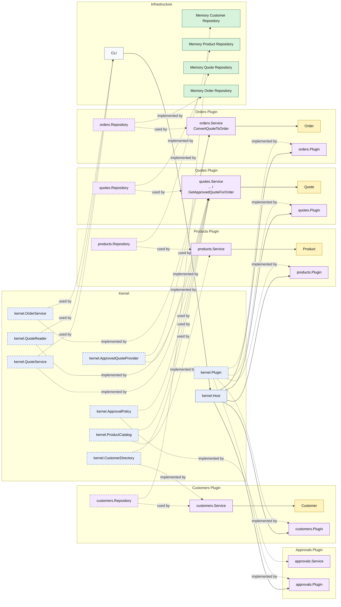

# Lesson 007: Convert Quote To Order

## Objective

Add the first cross-plugin fulfillment handoff by letting an `orders` plugin consume an approved-quote capability from the `quotes` plugin through the kernel.

## Theory

The previous lessons established the full quote-side workflow:

- draft quote creation
- quote editing
- policy-aware submission
- explicit approval

That makes the `quotes` plugin meaningful on its own.

The next architectural step is a real plugin-to-plugin business handoff:

- one plugin finishes its workflow
- another plugin begins its own workflow from that result

This lesson introduces that next idea:

- the kernel owns a narrow approved-quote capability
- the `quotes` plugin implements that capability
- a new `orders` plugin consumes it to create an order

This matters because a microkernel should not make plugins depend on each other's repositories or internal entities directly.

The handoff should happen through a kernel-owned extension seam.

That solves an important architectural problem:

- order creation depends on quote approval, but it still should not couple directly to quote storage or quote internals

The tradeoff is that the kernel now owns another cross-plugin handoff contract.

That is acceptable only if the contract stays narrow and capability-oriented rather than exposing entire plugin internals.

## Why This Matters Here

For this repository, the next Microkernel lesson should make one thing clear:

- `quotes` owns quote approval and quote conversion readiness
- `orders` owns order creation
- the handoff between them happens through a kernel capability for approved quotes

That makes the first true multi-plugin business workflow visible in the code.

## Diagram

Legend:

- blue: kernel-owned type or contract
- purple: plugin-owned service, repository contract, or plugin registration type
- yellow: plugin-owned domain type
- green: data adapter
- gray: framework edge
- dashed border: contract
- dashed arrow: structural relationship such as `used by` or `implemented by`

## Implementation Focus

Implement one handoff flow:

- convert an approved quote to an order

The code should show:

- a kernel-owned approved-quote capability
- the `quotes` plugin implementing it
- a new `orders` plugin using that capability to create an order
- the demo creating and then converting an approved quote

Do not add reservation or payment yet.

## What To Verify

- `go test ./...` passes
- the demo can convert an approved quote to an order
- converting a non-approved quote is rejected in tests
- the `orders` plugin does not access quote storage directly
