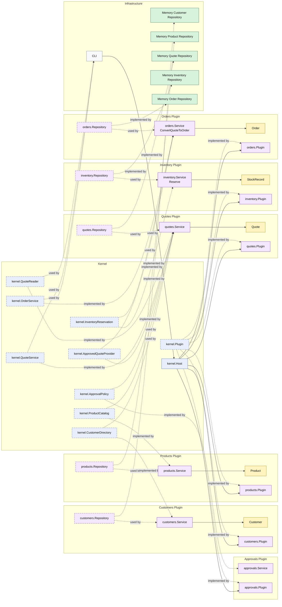

# Lesson 008: Order Conversion With Reservation

## Objective

Add the first operational side effect to the Microkernel track by making the `orders` plugin reserve inventory through a separate plugin capability before it saves the order.

## Theory

The previous lesson proved the first cross-plugin business handoff:

- the `quotes` plugin provides an approved-quote capability
- the `orders` plugin consumes it to create an order

That is useful, but it still assumes order creation is only a data translation step.

Real workflows usually need operational coordination too.

This lesson introduces that next pressure:

- converting a quote to an order should also reserve stock

In Microkernel terms, that becomes another extension seam:

- the kernel owns an inventory reservation capability
- an `inventory` plugin implements it
- the `orders` plugin consumes it before persisting the order

This solves an important architectural problem:

- operational side effects should still flow through kernel-owned capabilities instead of being embedded as direct repository access inside another plugin

The tradeoff is that order conversion becomes a multi-step orchestration:

- load approved quote
- derive reservation items
- reserve inventory
- save order

That makes the plugin workflow more realistic and more coupled to runtime collaboration, but still through stable seams.

## Why This Matters Here

For this repository, the next Microkernel lesson should make one thing clear:

- `orders` still owns order creation
- `inventory` owns stock reservation
- the `orders` plugin does not reach into inventory storage directly

That makes the architecture show not only feature handoff, but also operational coordination through plugin capabilities.

## Diagram

Legend:

- blue: kernel-owned type or contract
- purple: plugin-owned service, repository contract, or plugin registration type
- yellow: plugin-owned domain type
- green: data adapter
- gray: framework edge
- dashed border: contract
- dashed arrow: structural relationship such as `used by` or `implemented by`

## Implementation Focus

Implement one operational flow:

- convert an approved quote to an order and reserve stock

The code should show:

- a kernel-owned inventory reservation capability
- an `inventory` plugin implementing that capability
- the `orders` plugin consuming it before saving the order
- conversion failing when inventory cannot reserve the required quantity

Do not add payment yet.

## What To Verify

- `go test ./...` passes
- the demo can convert an approved quote to an order with reservation
- insufficient stock blocks conversion in tests
- the `orders` plugin still does not access inventory storage directly
