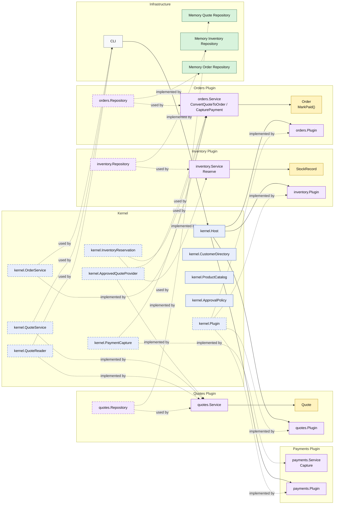

# Lesson 009: Payment Gateway And Order Capture

## Objective

Add the first order-side business integration seam by making the `orders` plugin capture payment through a separate plugin capability before it marks an order as paid.

## Theory

The previous lesson made order creation operational:

- the `orders` plugin consumes an approved quote
- it reserves inventory through another plugin capability
- it then saves the order

That makes order creation realistic, but the order lifecycle is still incomplete.

A real order does not stop at `PendingPayment`.

This lesson introduces the next pressure:

- payment capture should be a separate integration seam

In Microkernel terms, that becomes another kernel-owned capability:

- the kernel owns a payment capture contract
- a `payments` plugin implements it
- the `orders` plugin consumes it and then applies its own order transition

That distinction matters because:

- external payment execution is not the same thing as order lifecycle ownership

The payment plugin decides:

- whether payment can be captured successfully

The `orders` plugin still decides:

- whether an order is payable
- how its own status changes after a successful capture

This solves an important architectural problem:

- integration with an external business service should still pass through a stable kernel seam instead of being embedded directly in the `orders` plugin

The tradeoff is that another workflow step now depends on runtime plugin collaboration, but the boundary remains explicit.

## Why This Matters Here

For this repository, the next Microkernel lesson should make one thing clear:

- `orders` still owns order state
- `payments` owns payment capture integration
- `orders` becomes `Paid` only after the payment capability succeeds

That makes the first order-side integration seam visible in the architecture.

## Diagram

Legend:

- blue: kernel-owned type or contract
- purple: plugin-owned service, repository contract, or plugin registration type
- yellow: plugin-owned domain type
- green: data adapter
- gray: framework edge
- dashed border: contract
- dashed arrow: structural relationship such as `used by` or `implemented by`

## Implementation Focus

Implement one payment flow:

- capture payment for an order

The code should show:

- a kernel-owned payment capture capability
- a `payments` plugin implementing that capability
- the `orders` plugin consuming it and then marking the order paid
- payment capture rejected when the order is not payable

Do not add shipment yet.

## What To Verify

- `go test ./...` passes
- the demo can capture payment for the converted order
- capturing payment twice is rejected in tests
- the `orders` plugin still does not own payment integration directly
