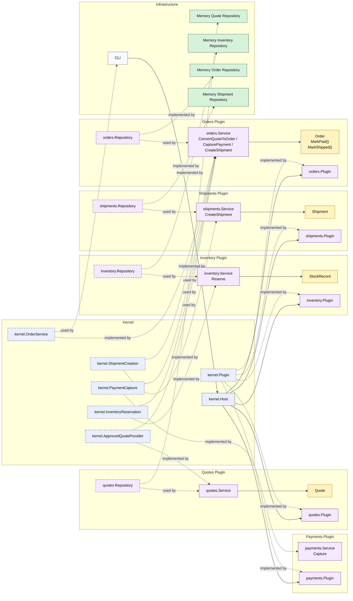

# Lesson 010: Shipment Creation After Payment

## Objective

Add the first shipping seam by making the `orders` plugin create a shipment through a separate plugin capability after payment succeeds.

## Theory

The previous lesson made the order lifecycle advance through payment:

- order conversion created `PendingPayment`
- payment capture moved the order to `Paid`

That is important, but a fulfillment workflow still needs a shipping step.

This lesson introduces that next architectural pressure:

- shipment creation should be a separate plugin capability
- but order shippability should still belong to the `orders` plugin

So this lesson introduces:

- a kernel-owned shipment creation capability
- a `shipments` plugin that implements it
- an order-side `MarkShipped()` transition inside the `orders` plugin

That distinction matters because:

- shipment persistence and creation are not the same thing as order lifecycle ownership

The shipments plugin decides:

- how shipment records are created and stored

The `orders` plugin still decides:

- whether an order is shippable
- when order status becomes `Shipped`

This solves an important architectural problem:

- fulfillment integration should still pass through a kernel seam instead of being collapsed into direct order-side storage

The tradeoff is that the order workflow now coordinates yet another plugin capability, but the boundary remains explicit and capability-oriented.

## Why This Matters Here

For this repository, the next Microkernel lesson should make one thing clear:

- `orders` still owns order state
- `shipments` owns shipment record creation
- an order becomes `Shipped` only after shipment creation succeeds

That completes the first narrow forward fulfillment path in the Microkernel track.

## Diagram

Legend:

- blue: kernel-owned type or contract
- purple: plugin-owned service, repository contract, or plugin registration type
- yellow: plugin-owned domain type
- green: data adapter
- gray: framework edge
- dashed border: contract
- dashed arrow: structural relationship such as `used by` or `implemented by`

## Implementation Focus

Implement one shipment flow:

- create a shipment for a paid order

The code should show:

- a kernel-owned shipment creation capability
- a `shipments` plugin implementing that capability
- the `orders` plugin consuming it and then marking the order shipped
- shipment creation rejected when the order is not shippable

Do not add cancellation yet.

## What To Verify

- `go test ./...` passes
- the demo can create a shipment after payment
- attempting to ship a non-paid order is rejected in tests
- the `orders` plugin still does not own shipment persistence directly
