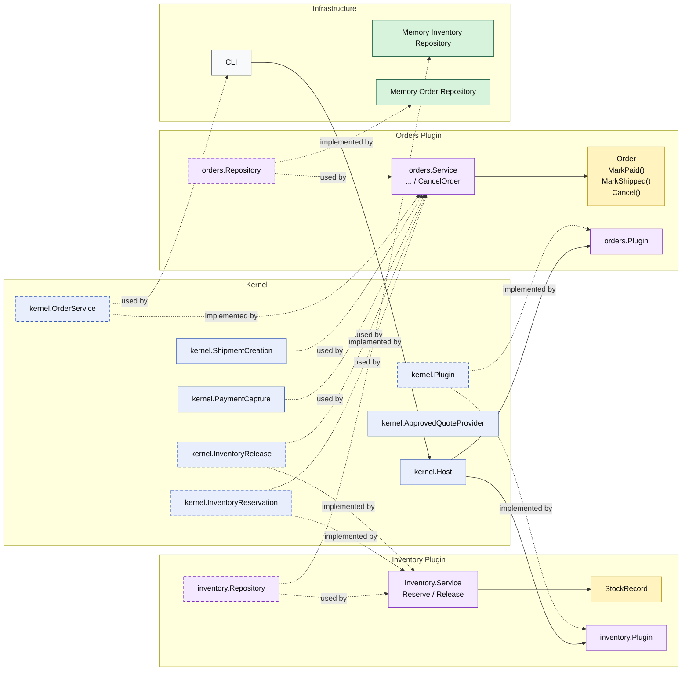

# Lesson 011: Order Cancellation And Release

## Objective

Add the first reverse order workflow by letting the `orders` plugin cancel an unshipped order and release reserved stock through a separate inventory capability.

## Theory

The previous lessons built a narrow forward fulfillment path:

- approved quote
- order conversion with reservation
- payment capture
- shipment creation

That shows how the system moves forward.

A realistic business workflow also needs a reverse path:

- what happens if an order must be cancelled before shipment?

This lesson introduces that next pressure:

- order cancellation should remain order-owned behavior
- inventory release should remain inventory-owned behavior

So this lesson introduces:

- a kernel-owned inventory release capability
- an `inventory` plugin that implements it
- an order-side `Cancel()` transition inside the `orders` plugin

That distinction matters because:

- releasing stock is an operational concern
- deciding whether an order can still be cancelled is an order lifecycle concern

This solves an important architectural problem:

- reverse workflow side effects should still cross plugin boundaries through stable kernel seams instead of being embedded directly into order storage logic

The tradeoff is that cancellation now becomes another coordinated workflow step, but the ownership stays explicit.

## Why This Matters Here

For this repository, the next Microkernel lesson should make one thing clear:

- `orders` owns cancellation rules
- `inventory` owns reservation release
- an already shipped order is not cancellable

That makes the first reverse order flow visible in the architecture.

## Diagram

Legend:

- blue: kernel-owned type or contract
- purple: plugin-owned service, repository contract, or plugin registration type
- yellow: plugin-owned domain type
- green: data adapter
- gray: framework edge
- dashed border: contract
- dashed arrow: structural relationship such as `used by` or `implemented by`

## Implementation Focus

Implement one reverse flow:

- cancel an unshipped order and release reserved stock

The code should show:

- a kernel-owned inventory release capability
- the `inventory` plugin implementing it alongside reservation
- the `orders` plugin cancelling only non-shipped orders
- release happening before the cancelled order is saved

Do not add returns yet.

## What To Verify

- `go test ./...` passes
- cancelling an unshipped order succeeds
- cancelling a shipped order is rejected
- inventory release is triggered during cancellation
