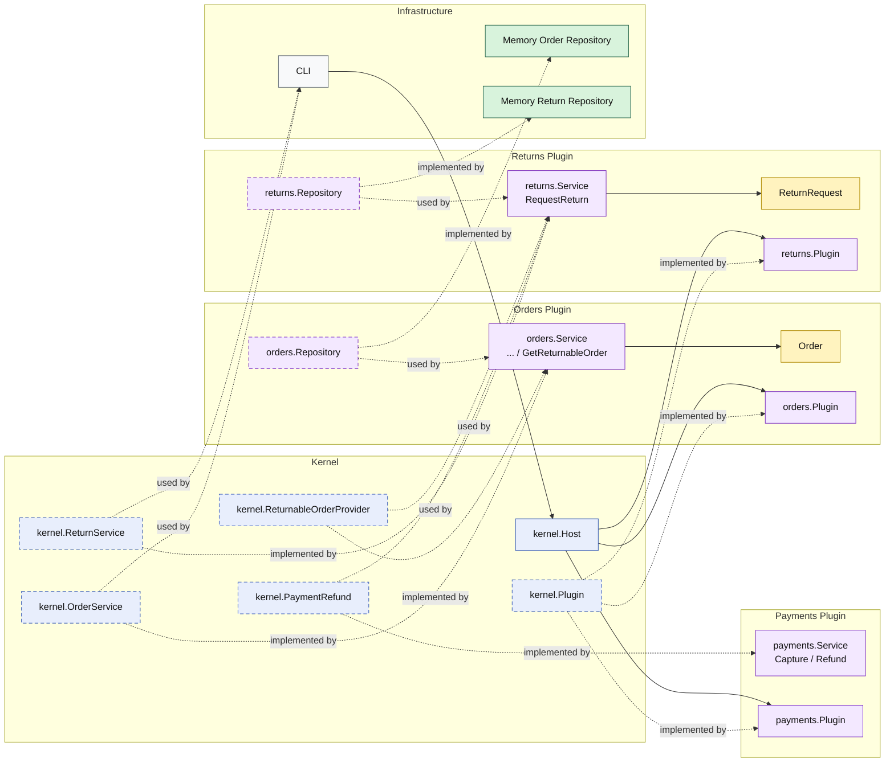

# Lesson 012: Return Request And Refund Plugin

## Objective

Add the first post-shipment reverse workflow by letting a new returns plugin request a return against a shipped order and refund payment through a separate plugin capability.

## Theory

The previous lesson handled cancellation before shipment.

After shipment, cancellation is no longer the right operation. The system now needs a return workflow instead.

In a microkernel design, the kernel stays small and owns only the shared contracts that allow plugins to collaborate. That means the kernel can define:

- a `ReturnableOrderProvider` capability that describes the order data needed to request a return
- a `PaymentRefund` capability that describes how a refund is triggered
- a `ReturnService` capability that the host can expose to the outside world

The orders plugin implements the returnable-order capability because it owns order state.

The payments plugin implements the refund capability because it owns payment behavior.

The returns plugin coordinates both capabilities and persists the return request in its own repository.

This keeps responsibilities separated:

- orders still decide whether an order is returnable
- payments still decide how refunds are executed
- returns owns the return workflow itself

## Why This Matters Here

This is the first lesson where one plugin coordinates two other plugin-provided capabilities after the order lifecycle has already moved forward.

That is important in microkernel architecture because it shows the difference between:

- adding more logic into an existing plugin
- adding a new plugin that composes existing kernel capabilities

The second option is the extensibility story the architecture is meant to support.

## Diagram

Legend:

- blue: kernel-owned type or contract
- purple: plugin-owned service, repository contract, or plugin registration type
- yellow: plugin-owned domain type
- green: data adapter
- gray: framework edge
- dashed border: contract
- dashed arrow: structural relationship such as `used by` or `implemented by`

## Implementation Focus

- add a kernel capability for loading a returnable order view
- add a kernel capability for refunding a payment
- expose both capabilities from the relevant plugins
- implement a returns plugin that orchestrates the reverse flow
- persist a return request as its own plugin-owned model
- reject orders that are not yet in a returnable state

## What To Verify

- `go test ./...` passes
- the demo can request a return for a shipped order
- the return workflow uses the order capability instead of reaching into order storage directly
- the refund goes through the payment capability
- non-shipped orders are rejected as not returnable
