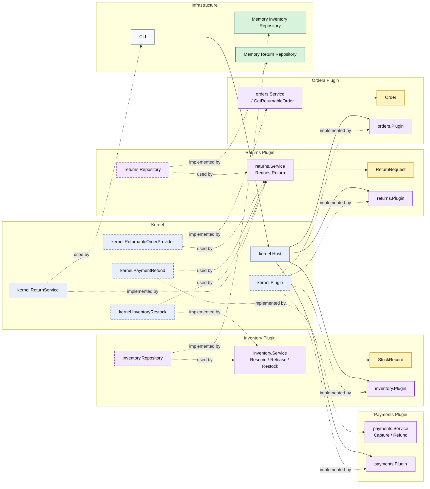

# Lesson 013: Return Restocking Plugin

## Objective

Extend the return workflow so refunded returns also restock inventory through a distinct inventory capability exposed by the microkernel.

## Theory

Lesson `012` introduced a new `returns` plugin and showed that post-shipment reversal can be implemented by composing kernel capabilities from other plugins.

But that flow still reversed only the money side:

- load a returnable order
- refund the payment
- store the return request

It did not reverse stock.

This lesson makes stock reversal explicit by adding a separate kernel-owned `InventoryRestock` capability.

That matters because:

- `orders` still owns whether an order is returnable
- `payments` still owns refund behavior
- `inventory` owns stock changes
- `returns` orchestrates the workflow, but does not own inventory rules

The microkernel value here is not that one plugin does everything.

It is that a new workflow can be assembled by combining stable capabilities from other plugins while keeping ownership where it belongs.

## Why This Matters Here

This is the first microkernel lesson where one plugin coordinates three distinct capabilities from the rest of the system:

- order lookup for a returnable order
- payment refund
- inventory restock

That makes the host-plus-capability model more concrete than the earlier forward-only flow.

## Diagram

Legend:

- blue: kernel-owned type or contract
- purple: plugin-owned service, repository contract, or plugin registration type
- yellow: plugin-owned domain type
- green: data adapter
- gray: framework edge
- dashed border: contract
- dashed arrow: structural relationship such as `used by` or `implemented by`

## Implementation Focus

- add a kernel-owned `InventoryRestock` capability
- expose that capability from the `inventory` plugin
- make the `returns` plugin refund and restock in the same workflow
- keep return persistence inside the `returns` plugin

Do not add return review yet.

## What To Verify

- `go test ./...` passes
- successful return requests trigger both refund and restock
- a restock failure stops the workflow
- restocking still happens through an inventory capability rather than direct repository access from `returns`
