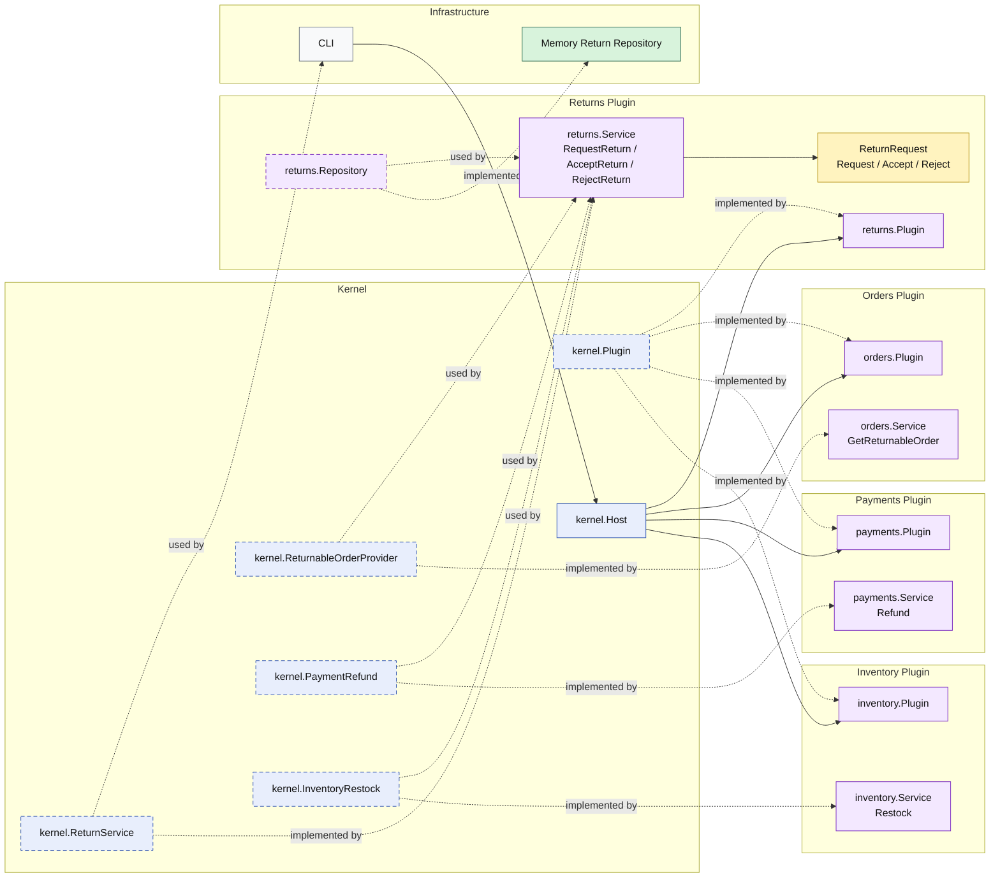

# Lesson 014: Return Review Plugin

## Objective

Insert an explicit review step into the return workflow so a return request is created first, and refund plus restock happen only when the request is accepted.

## Theory

Lesson `013` completed the technical reversal for a shipped order:

- load a returnable order
- refund payment
- restock inventory
- store the return request

That works mechanically, but it assumes every request should be accepted immediately.

This lesson introduces a real workflow boundary:

- requesting a return
- accepting a return
- rejecting a return

In microkernel architecture, the important point is not only adding more states.

It is keeping ownership explicit:

- the `returns` plugin owns the return-request state machine
- the `payments` plugin still owns refunds
- the `inventory` plugin still owns restocking
- the kernel exposes the capabilities that let those plugins collaborate

That makes return review a first-class plugin workflow instead of an implicit side effect of request creation.

## Why This Matters Here

This is the first lesson where the `returns` plugin becomes more than a thin orchestration wrapper.

It now owns:

- the persistent return request
- the `Requested` state
- the acceptance path
- the rejection path

That makes the plugin boundary more meaningful, because the workflow state now lives in the plugin that owns the process.

## Diagram

Legend:

- blue: kernel-owned type or contract
- purple: plugin-owned service, repository contract, or plugin registration type
- yellow: plugin-owned domain type
- green: data adapter
- gray: framework edge
- dashed border: contract
- dashed arrow: structural relationship such as `used by` or `implemented by`

## Implementation Focus

- make `RequestReturn` create only a requested return
- add explicit `AcceptReturn` and `RejectReturn` operations to the return capability
- move refund and restock to the acceptance path
- keep rejection side-effect free

Do not add return policy yet.

## What To Verify

- `go test ./...` passes
- request creation stores only a requested return
- accepting a return triggers refund and restock
- rejecting a return does not trigger refund or restock
