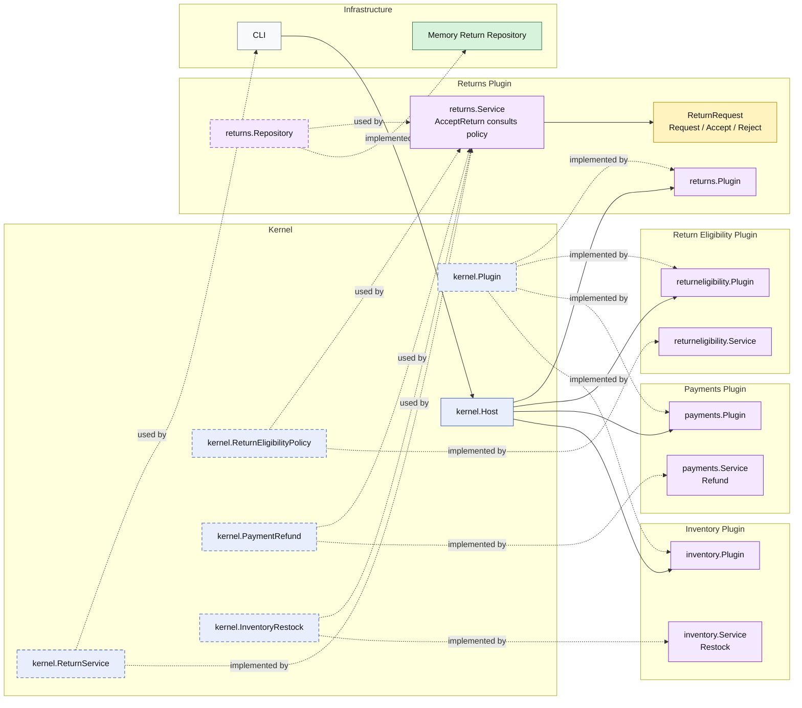

# Lesson 015: Return Eligibility Plugin

## Objective

Make return acceptance policy-aware by moving the acceptance rule into a dedicated eligibility plugin exposed through a kernel capability.

## Theory

Lesson `014` introduced a real review workflow:

- request a return
- accept a return
- reject a return

But acceptance was still unconditional.

This lesson makes one more boundary explicit:

- the `returns` plugin owns the return review workflow
- a separate `returneligibility` plugin owns the acceptance rule
- the `payments` and `inventory` plugins still own the side effects after acceptance

That matters because workflow orchestration and business policy change for different reasons.

In a microkernel design, the kernel provides the stable capability seam and a plugin supplies the current rule implementation.

## Why This Matters Here

Without a separate policy seam, the `returns` plugin would accumulate both:

- return state management
- acceptance policy logic

That is manageable for one `if` statement, but it gets muddy quickly when policy grows. A separate plugin keeps the rule replaceable and easier to evolve.

## Diagram

Legend:

- blue: kernel-owned type or contract
- purple: plugin-owned service, repository contract, or plugin registration type
- yellow: plugin-owned domain type
- green: data adapter
- gray: framework edge
- dashed border: contract
- dashed arrow: structural relationship such as `used by` or `implemented by`

## Implementation Focus

- add a kernel-owned return eligibility capability
- implement it with a dedicated `returneligibility` plugin
- make `AcceptReturn` ask that policy before refund and restock
- auto-reject blocked returns without side effects

Do not add a real date-based return window yet.

## What To Verify

- `go test ./...` passes
- eligible returns still refund and restock
- policy-blocked returns are rejected
- blocked returns do not refund or restock
