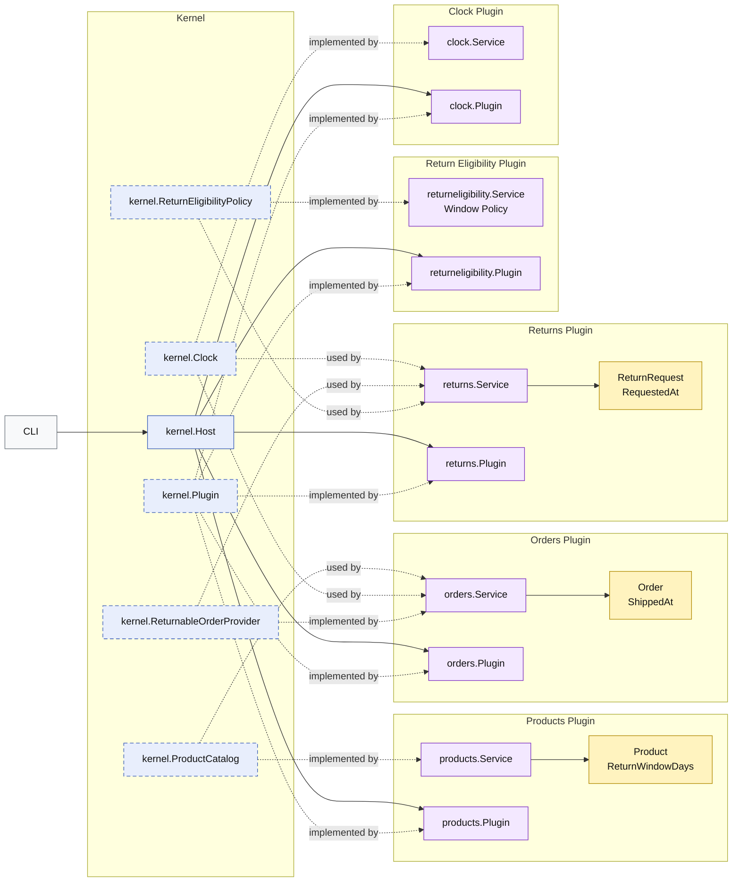

# Lesson 016: Real Return Window Plugin

## Objective

Replace the placeholder return-eligibility rule with a real time-based return-window policy that uses shipped timestamps and per-line return-window snapshots.

## Theory

Lesson `015` separated return acceptance policy from the review workflow.

That was the right boundary, but the concrete rule was still only a placeholder:

- reject when the reason string says `outside return window`

This lesson turns that seam into a real business rule by carrying the facts the policy actually needs:

- products define `ReturnWindowDays`
- quotes snapshot that value on each line
- orders carry the snapshot forward
- orders record `ShippedAt`
- return requests record `RequestedAt`

The policy plugin can then decide eligibility from business data instead of a magic string.

This also introduces time as an explicit kernel capability, because business logic needs time facts without calling the system clock directly from plugin workflow code.

## Why This Matters Here

This lesson shows an important microkernel pressure:

- a more realistic policy often forces multiple plugins to carry richer business snapshots

The eligibility plugin did not become realistic by changing one function alone. It required:

- richer product data
- richer order data
- a clock capability
- richer return-request data

That is the kind of cross-plugin refinement that makes architecture tradeoffs visible.

## Diagram

Legend:

- blue: kernel-owned type or contract
- purple: plugin-owned service or plugin registration type
- yellow: plugin-owned domain type
- gray: framework edge
- dashed border: contract
- dashed arrow: structural relationship such as `used by` or `implemented by`

## Implementation Focus

- add a kernel clock capability
- record `ReturnWindowDays` on quote, order, and return snapshots
- stamp `ShippedAt` when an order is shipped
- stamp `RequestedAt` when a return is requested
- evaluate the real return window in the eligibility plugin

Do not add reviewer metadata yet.

## What To Verify

- `go test ./...` passes
- returns inside the window can be accepted
- returns outside the window are rejected
- orders and returns get their timestamps from the clock capability
