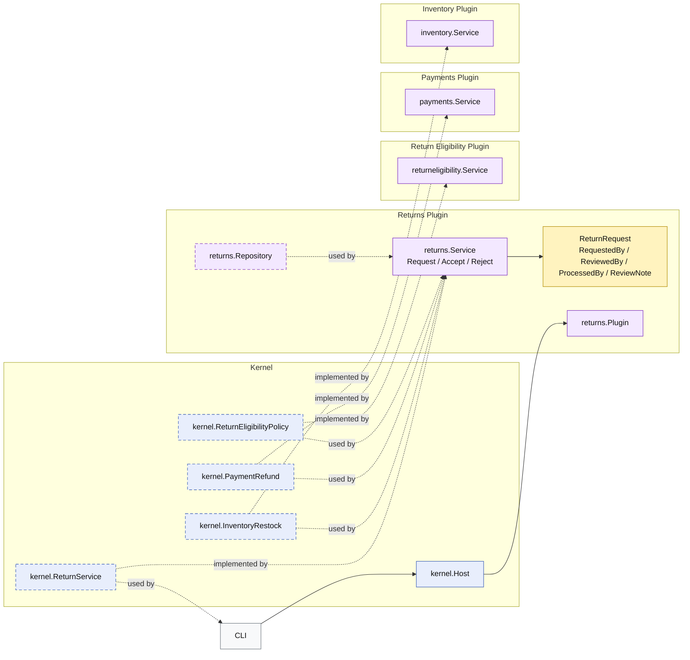

# Lesson 017: Return Actor Metadata Plugin

## Objective

Make the return workflow auditable by recording who requested, reviewed, and processed each return.

## Theory

The return workflow now has:

- request
- policy-aware review
- refund and restock on acceptance
- rejection when the review fails

But without actor metadata, the workflow still lacks operational accountability.

This lesson adds that missing part:

- the requester is recorded when the return is opened
- the reviewer is recorded when the request is accepted or rejected
- the processor is recorded when acceptance triggers refund and restock
- review notes travel with the decision

That keeps the auditing concern inside the `returns` workflow where it belongs, instead of scattering actor fields across payment or inventory plugins.

## Why This Matters Here

This is the point where the returns plugin stops being only a state machine and starts to look like a real business record.

Operational workflows often need answers to questions like:

- who asked for the return?
- who approved it?
- who processed the financial and stock reversal?
- what note was attached to the decision?

Those questions are part of the return workflow itself, not side effects of payments or inventory.

## Diagram

Legend:

- blue: kernel-owned type or contract
- purple: plugin-owned service or plugin registration type
- yellow: plugin-owned domain type
- gray: framework edge
- dashed border: contract
- dashed arrow: structural relationship such as `used by` or `implemented by`

## Implementation Focus

- add actor metadata to the return request record
- require requester information on request creation
- require reviewer and processor information on acceptance
- require reviewer information on rejection

Do not add idempotency yet.

## What To Verify

- `go test ./...` passes
- return requests require a requester
- accepting a return records reviewer and processor
- rejecting a return records reviewer without processing side effects
